# HiFiShifter 后端详细分析

> 文档生成时间：2026-03-16  
> 项目版本：v0.1.0-beta.6

---

## 一、技术栈详解

### 1.1 核心技术

| 技术 | 版本 | 用途 | 选型理由 |
|------|------|------|----------|
| **Rust** | 1.80+ | 系统编程语言 | 内存安全、零成本抽象、高性能 |
| **Tauri** | 2.0 | 桌面应用框架 | 轻量、跨平台、安全 |
| **cpal** | 0.16 | 音频 I/O | 跨平台低延迟音频回调 |
| **rodio** | 0.20 | 音频播放 | 解码与混音 |

### 1.2 音频处理库

| 库名 | 用途 |
|------|------|
| symphonia | 多格式音频解码（WAV/FLAC/MP3等） |
| hound | WAV 编码输出 |
| rubato | 高质量采样率转换 |
| Signalsmith Stretch | 时间伸缩算法 |
| rubato | 重采样

### 1.3 声码器与模型

| 组件 | 用途 |
|------|------|
| WORLD | 传统声码器（Harvest/DIO音高分析） |
| NSF-HiFiGAN ONNX | 深度学习声码器（高音质合成） |
| vslib (VocalShifter) | 兼容 VocalShifter 项目 |

---

## 二、架构分层

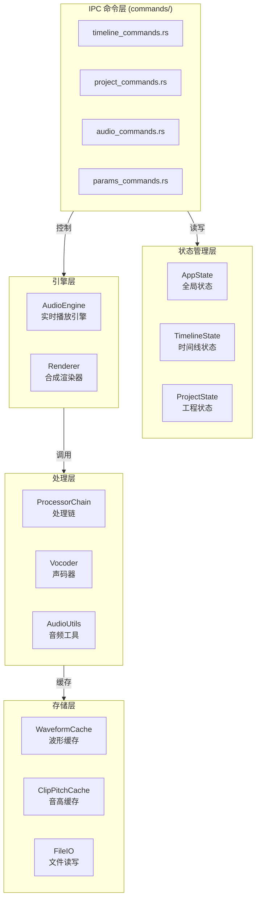

---

## 三、目录结构详解

```
backend/src-tauri/src/
├── lib.rs                        # 库入口，注册所有命令
├── main.rs                       # 应用入口，Tauri 配置
├── state.rs                      # AppState 全局状态定义 (~82KB)
│
├── commands/                     # Tauri IPC 命令层
│   ├── mod.rs                    # 模块导出
│   ├── timeline_commands.rs      # 时间线操作命令
│   ├── project_commands.rs       # 工程管理命令
│   ├── audio_commands.rs         # 音频播放命令
│   ├── params_commands.rs        # 参数曲线命令
│   ├── transport_commands.rs     # 播放控制命令
│   ├── waveform_commands.rs      # 波形数据命令
│   └── import_commands.rs        # 导入相关命令
│
├── audio/                        # 音频处理工具
│   ├── mod.rs                    # 模块导出
│   ├── audio_io.rs               # 音频读写（WAV/FLAC等）
│   ├── audio_resample.rs         # 重采样处理
│   ├── audio_stretch.rs          # 时间伸缩
│   ├── audio_stretch_optimized.rs # 优化版时间伸缩
│   ├── audio_utils.rs            # 通用音频工具
│   ├── waveform_cache.rs         # 波形缓存
│   ├── mixdown.rs                # 混音合成
│   ├── player_mixer.rs           # 播放混音器
│   └── rubberband_stretcher.rs   # Rubberband 封装
│
├── audio_engine/                 # 实时音频引擎
│   ├── mod.rs                    # 模块导出
│   ├── audio_engine.rs           # AudioEngine 主类
│   ├── audio_output.rs           # cpal 音频输出
│   ├── event_emitter.rs          # 事件发射器
│   ├── player_track.rs           # 播放轨道
│   ├── mixer.rs                  # 混音器
│   └── clip_player.rs            # 剪辑播放器
│
├── renderer/                     # 合成渲染器
│   ├── mod.rs                    # 模块导出
│   ├── renderer.rs               # Renderer 主接口
│   ├── renderer_types.rs         # 类型定义
│   ├── processor_chain.rs        # 处理链（Stage 组合）
│   ├── time_stretch_stage.rs     # 时间伸缩 Stage
│   ├── pitch_shift_stage.rs      # 音高偏移 Stage
│   ├── param_curve_stage.rs      # 参数曲线 Stage
│   ├── world_processor.rs        # WORLD 声码器处理
│   ├── hifigan_processor.rs      # HiFiGAN 处理
│   └── vslib_processor.rs        # vslib 处理
│
├── vocoder/                      # 声码器实现
│   ├── mod.rs                    # 模块导出
│   ├── world_vocoder.rs          # WORLD 声码器
│   ├── hifigan_vocoder.rs        # HiFiGAN 声码器
│   ├── vslib_vocoder.rs          # vslib 声码器
│   └── pitch_analysis.rs         # 音高分析入口
│
├── pitch/                        # 音高处理
│   ├── mod.rs                    # 模块导出
│   ├── pitch_analysis.rs         # 音高分析核心
│   ├── pitch_utils.rs            # 音高工具
│   └── pitch_shift.rs            # 音高偏移
│
├── pitch_analysis/               # 音高分析调度
│   ├── mod.rs                    # 模块导出
│   ├── dispatcher.rs             # 分析调度器
│   ├── harvest_analyzer.rs       # Harvest 分析器
│   └── dio_analyzer.rs           # DIO 分析器
│
├── import/                       # 项目导入
│   ├── mod.rs                    # 模块导出
│   ├── vocalshifter_import.rs    # VocalShifter 导入
│   └── reaper_import.rs          # REAPER 导入
│
├── models/                       # 数据模型
│   ├── mod.rs                    # 模块导出
│   ├── timeline.rs               # 时间线模型
│   ├── clip.rs                   # 剪辑模型
│   ├── track.rs                  # 轨道模型
│   ├── params.rs                 # 参数模型
│   └── project.rs                # 工程模型
│
├── project/                      # 工程管理
│   ├── mod.rs                    # 模块导出
│   ├── project_loader.rs         # 工程加载
│   ├── project_saver.rs          # 工程保存
│   └── custom_scale.rs           # 自定义音阶
│
├── clip_pitch_cache.rs           # Clip 音高缓存
├── undo.rs                       # 撤销/重做系统
├── ui_bridge.rs                  # UI 桥接层
└── waveform/                     # 波形处理
    ├── mod.rs                    # 模块导出
    └── peaks.rs                  # 峰值计算
```

---

## 四、全局状态管理

### 4.1 AppState 结构

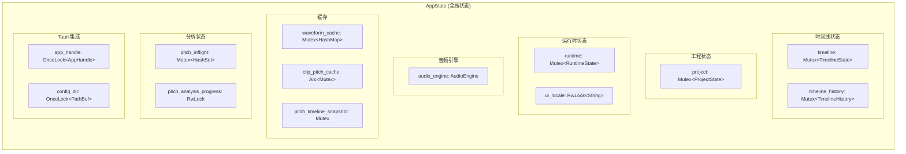

### 4.2 核心状态字段

```rust
pub struct AppState {
    // 时间线状态
    pub timeline: std::sync::Mutex<TimelineState>,
    pub timeline_history: std::sync::Mutex<TimelineHistory>,
    
    // 工程状态
    pub project: std::sync::Mutex<ProjectState>,
    
    // 运行时状态
    pub runtime: std::sync::Mutex<RuntimeState>,
    pub ui_locale: RwLock<String>,
    
    // 检查点控制
    pub suppress_checkpoints: std::sync::atomic::AtomicBool,
    
    // 波形缓存
    pub waveform_cache_dir: std::sync::Mutex<PathBuf>,
    pub waveform_cache: std::sync::Mutex<HashMap<String, Arc<CachedPeaks>>>,
    
    // 音高分析缓存
    pub pitch_inflight: std::sync::Mutex<HashSet<String>>,
    pub pitch_analysis_progress: std::sync::RwLock<Option<PitchOrigAnalysisProgressEvent>>,
    pub clip_pitch_cache: Arc<Mutex<ClipPitchCache>>,
    pub pitch_timeline_snapshot: Mutex<HashMap<String, TimelineSnapshot>>,
    
    // 音频引擎
    pub audio_engine: AudioEngine,
    
    // Tauri 句柄
    pub app_handle: OnceLock<tauri::AppHandle>,
    pub config_dir: OnceLock<std::path::PathBuf>,
}
```

---

## 五、音频引擎详解

### 5.1 AudioEngine 架构

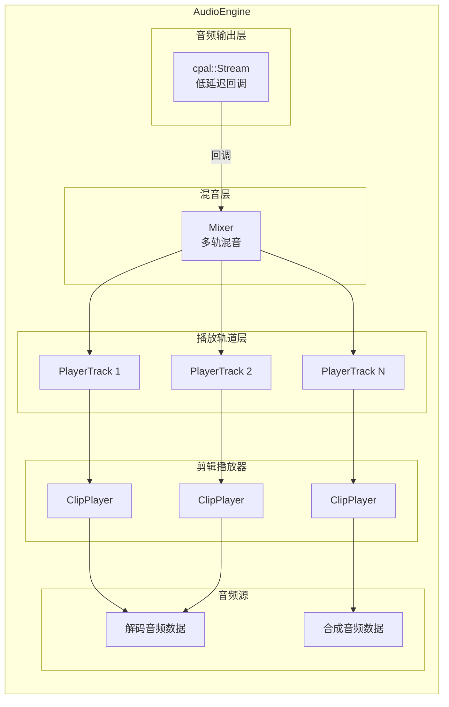

### 5.2 播放流程

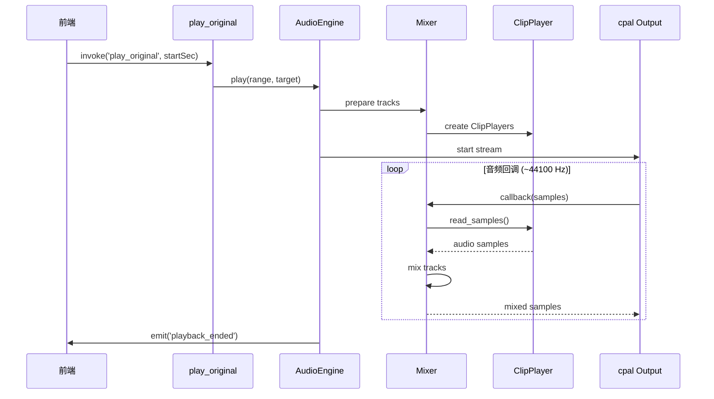

### 5.3 播放状态机

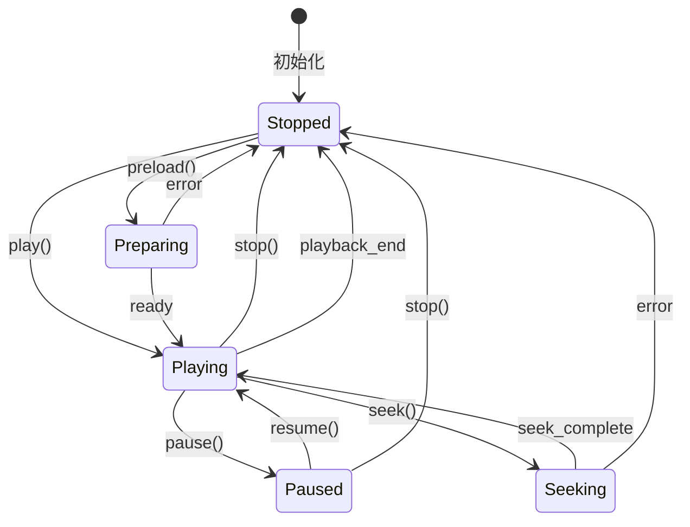

---

## 六、声码器系统

### 6.1 声码器架构

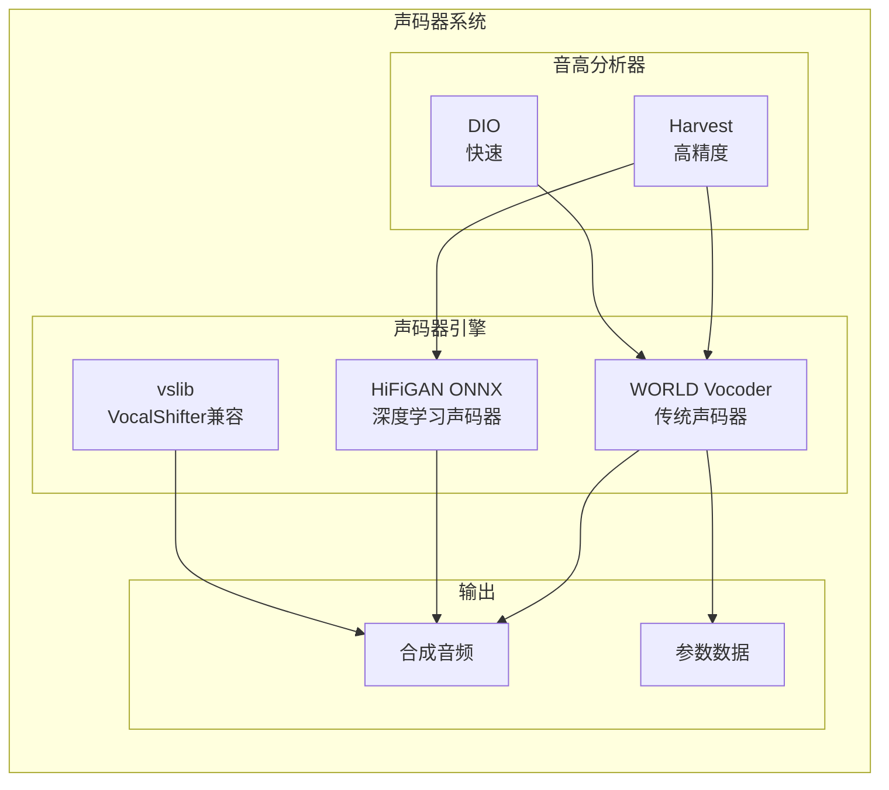

### 6.2 声码器选择策略

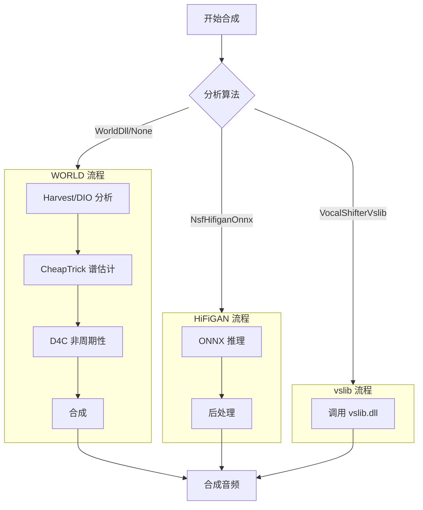

### 6.3 声码器对比

| 特性 | WORLD | NSF-HiFiGAN | vslib |
|------|-------|-------------|-------|
| **音质** | 良好 | 优秀 | 良好 |
| **速度** | 中等 | 快（GPU） | 快 |
| **依赖** | 纯 Rust | ONNX Runtime | DLL |
| **适用场景** | 通用 | 高质量合成 | VS 兼容 |

---

## 七、渲染器系统

### 7.1 ProcessorChain 架构

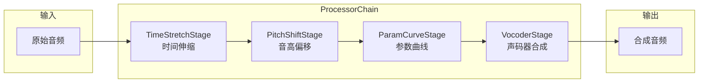

### 7.2 Stage 接口

```rust
pub trait Stage: Send + Sync {
    /// 处理音频数据
    fn process(&self, input: &AudioBuffer) -> Result<AudioBuffer>;
    
    /// 是否需要重新处理
    fn is_dirty(&self) -> bool;
    
    /// 标记为需要重新处理
    fn mark_dirty(&mut self);
    
    /// 获取处理参数
    fn get_params(&self) -> StageParams;
    
    /// 设置处理参数
    fn set_params(&mut self, params: StageParams);
}
```

### 7.3 渲染流程

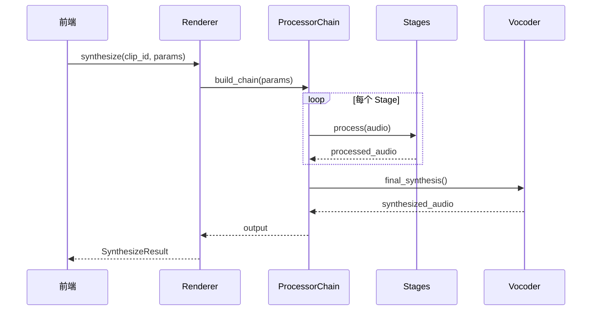

---

## 八、命令层详解

### 8.1 命令注册

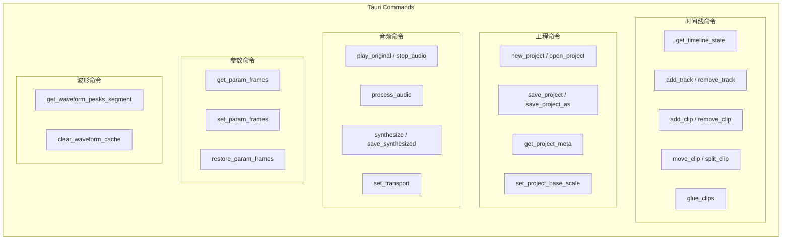

### 8.2 主要命令列表

| 命令 | 文件 | 用途 |
|------|------|------|
| `get_timeline_state` | timeline_commands.rs | 获取完整时间线状态 |
| `add_track` | timeline_commands.rs | 添加新轨道 |
| `remove_track` | timeline_commands.rs | 删除轨道 |
| `add_clip` | timeline_commands.rs | 添加剪辑 |
| `move_clip` | timeline_commands.rs | 移动剪辑 |
| `split_clip` | timeline_commands.rs | 分割剪辑 |
| `glue_clips` | timeline_commands.rs | 合并剪辑 |
| `open_project` | project_commands.rs | 打开工程 |
| `save_project` | project_commands.rs | 保存工程 |
| `play_original` | audio_commands.rs | 播放原始音频 |
| `synthesize` | audio_commands.rs | 合成处理后的音频 |
| `get_param_frames` | params_commands.rs | 获取参数曲线帧数据 |
| `set_param_frames` | params_commands.rs | 设置参数曲线 |

---

## 九、后端链路详解

### 9.1 音频加载链路

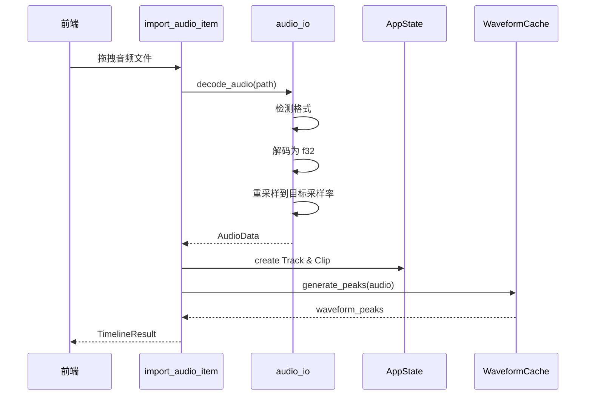

### 9.2 音高分析链路

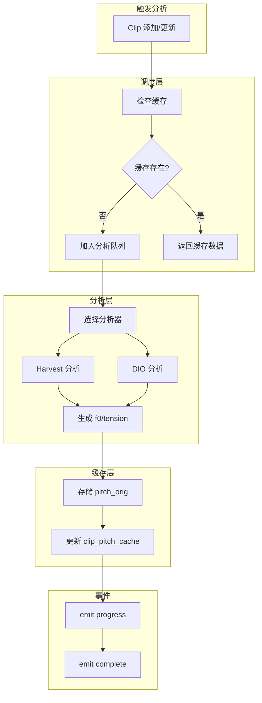

### 9.3 合成渲染链路

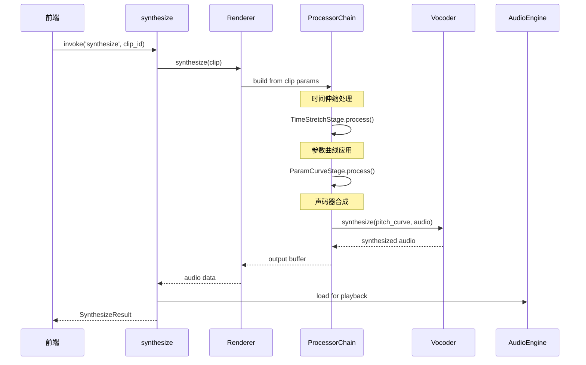

### 9.4 工程保存链路

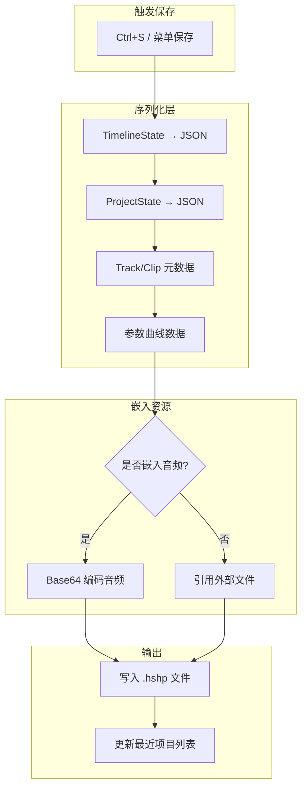

---

## 十、缓存策略

### 10.1 缓存架构

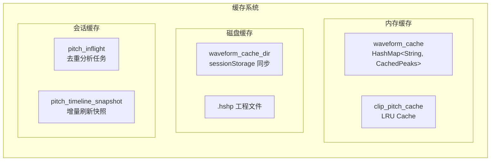

### 10.2 缓存策略

| 缓存类型 | 位置 | 淘汰策略 | 持久化 |
|----------|------|----------|--------|
| 波形 Peaks | 内存 + sessionStorage | LRU (512条) | 否 |
| Clip 音高缓存 | 内存 | LRU (100条) | 否 |
| 音高分析进度 | 内存 | 手动清除 | 否 |
| 工程状态 | 内存 | 无 | 是 (.hshp) |

---

## 十一、线程模型

### 11.1 线程架构

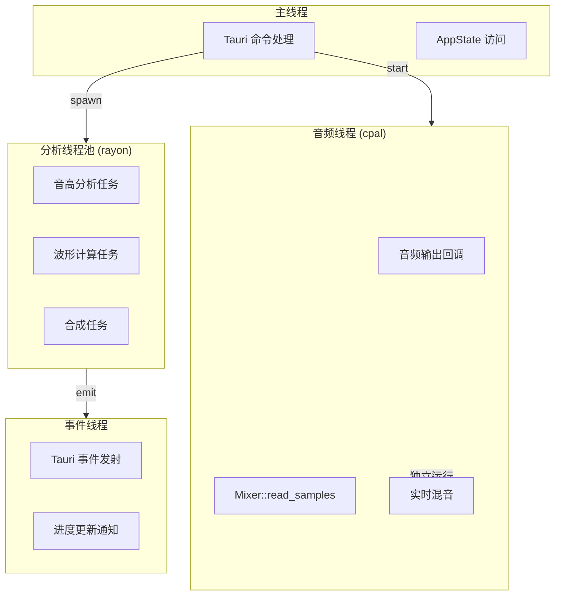

### 11.2 同步原语

```rust
// Mutex 用于独占访问
pub timeline: Mutex<TimelineState>,
pub project: Mutex<ProjectState>,

// RwLock 用于读写分离
pub ui_locale: RwLock<String>,
pub pitch_analysis_progress: RwLock<Option<...>>,

// AtomicBool 用于标志位
pub suppress_checkpoints: AtomicBool,

// OnceLock 用于单次初始化
pub app_handle: OnceLock<AppHandle>,
```

---

## 十二、性能优化

### 12.1 优化策略

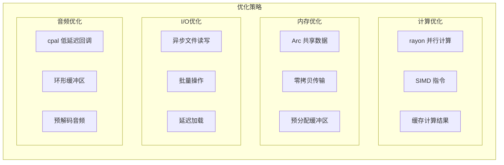

### 12.2 关键优化点

| 优化点 | 方法 | 效果 |
|--------|------|------|
| 音高分析 | rayon 并行 | 多核加速 |
| 波形渲染 | 分段缓存 | 减少计算 |
| 合成过程 | ONNX GPU | 提速 10x |
| 音频播放 | cpal 回调 | 延迟 <10ms |
| 状态更新 | 批量操作 | 减少锁竞争 |

---

## 十三、扩展指南

### 13.1 新增 IPC 命令

1. 在 `commands/` 下创建或编辑命令文件
2. 添加 `#[tauri::command]` 函数
3. 在 `lib.rs` 的 `invoke_handler` 中注册
4. 在前端 `services/api/` 添加对应调用

```rust
// commands/my_commands.rs
#[tauri::command]
pub fn my_new_command(state: State<'_, AppState>, arg: String) -> Result<MyResult, String> {
    // 实现逻辑
    Ok(MyResult { ... })
}

// lib.rs
.invoke_handler(tauri::generate_handler![
    // ...existing commands...
    my_new_command,
])
```

### 13.2 新增声码器

1. 在 `vocoder/` 下创建新模块
2. 实现 `Vocoder` trait
3. 在 `renderer/vocoder_selector.rs` 添加选择逻辑
4. 更新 `PitchAnalysisAlgo` 枚举

### 13.3 新增处理 Stage

1. 在 `renderer/` 下创建 `my_stage.rs`
2. 实现 `Stage` trait
3. 在 `processor_chain.rs` 添加到链中
4. 暴露参数配置接口

---

*文档由 AI 自动生成，如有疑问请参考源代码或联系开发者。*