# HiFiShifter 前端详细分析

> 文档生成时间：2026-03-16  
> 项目版本：v0.1.0-beta.6

---

## 一、技术栈详解

### 1.1 核心技术

| 技术 | 版本 | 用途 | 选型理由 |
|------|------|------|----------|
| **React** | 19.2.0 | UI框架 | 组件化、虚拟DOM、生态丰富 |
| **TypeScript** | 5.9.3 | 开发语言 | 类型安全、IDE支持、代码可维护性 |
| **Vite** | 7.3.1 | 构建工具 | 极速HMR、ESM原生支持、简洁配置 |
| **Redux Toolkit** | 2.11.2 | 状态管理 | 可预测状态、时间旅行调试、中间件生态 |
| **Radix UI Themes** | 3.3.0 | UI组件库 | 无障碍设计、无样式冲突、可定制 |
| **Tailwind CSS** | 3.4.17 | 样式方案 | 原子化CSS、快速开发、体积优化 |

### 1.2 桌面集成

| 包名 | 版本 | 用途 |
|------|------|------|
| @tauri-apps/api | 2.0.0 | Tauri IPC通信 |
| @tauri-apps/plugin-dialog | 2.0.0 | 原生对话框 |
| @tauri-apps/plugin-fs | 2.0.0 | 文件系统操作 |

---

## 二、架构分层

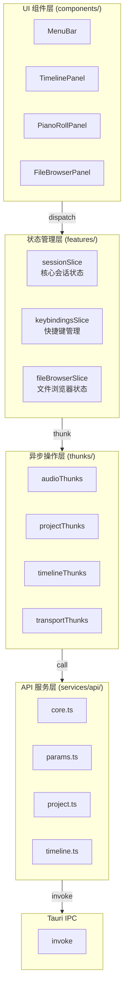

---

## 三、目录结构详解

```
frontend/src/
├── app/                          # Redux Store 配置
│   ├── hooks.ts                  # Typed Hooks (useAppDispatch, useAppSelector)
│   └── store.ts                  # Store 配置与 Reducer 组合
│
├── components/                   # React 组件
│   ├── editDialogs/              # 编辑对话框
│   │   ├── EditContextMenu.tsx   # 右键菜单
│   │   └── EditDialogs.tsx       # 编辑对话框集合
│   │
│   ├── layout/                   # 主要布局组件
│   │   ├── ActionBar.tsx         # 操作栏（工具切换、缩放控制）
│   │   ├── FileBrowserPanel.tsx  # 文件浏览器面板
│   │   ├── MenuBar.tsx           # 菜单栏（文件/编辑/视图）
│   │   ├── PianoRollPanel.tsx    # 钢琴卷帘面板（参数编辑）
│   │   ├── TimelinePanel.tsx     # 时间线面板（多轨道）
│   │   ├── pianoRoll/            # PianoRoll 子模块
│   │   │   ├── render.ts         # Canvas 渲染逻辑
│   │   │   ├── usePianoRollData.ts       # 数据获取 Hook
│   │   │   ├── usePianoRollInteractions.ts # 交互处理 Hook
│   │   │   ├── useLiveParamEditing.ts    # 实时编辑 Hook
│   │   │   └── constants.ts      # 常量定义
│   │   └── timeline/             # Timeline 子模块
│   │       ├── BackgroundGrid.tsx        # 背景网格
│   │       ├── ClipItem.tsx      # 剪辑项组件
│   │       ├── TrackList.tsx     # 轨道列表
│   │       ├── TimeRuler.tsx     # 时间标尺
│   │       └── hooks/            # Timeline Hooks
│   │
│   ├── LoadingSpinner.tsx        # 加载动画
│   └── ProgressBar.tsx           # 进度条
│
├── contexts/                     # React Context
│   ├── PianoRollStatusContext.tsx    # PianoRoll 状态上下文
│   └── PitchAnalysisContext.tsx      # 音高分析状态上下文
│
├── features/                     # Redux Slices
│   ├── session/                  # 核心会话状态（~94KB）
│   │   ├── sessionSlice.ts       # 主要 Slice
│   │   ├── sessionTypes.ts       # 类型定义
│   │   └── thunks/               # 异步 Thunks
│   │       ├── audioThunks.ts    # 音频操作
│   │       ├── importThunks.ts   # 导入操作
│   │       ├── projectThunks.ts  # 工程操作
│   │       ├── timelineThunks.ts # 时间线操作
│   │       ├── trackThunks.ts    # 轨道操作
│   │       ├── transportThunks.ts # 播放控制
│   │       └── runtimeThunks.ts  # 运行时状态
│   │
│   ├── fileBrowser/              # 文件浏览器状态
│   │   └── fileBrowserSlice.ts
│   │
│   └── keybindings/              # 快捷键管理
│       ├── defaultKeybindings.ts # 默认快捷键配置
│       ├── keybindingsSlice.ts   # 快捷键状态
│       └── useKeybindings.ts     # 快捷键 Hook
│
├── hooks/                        # 全局自定义 Hooks
│   ├── useAsyncPitchRefresh.ts   # 异步音高刷新
│   └── useClipPitchDataListener.ts # Clip 音高数据监听
│
├── i18n/                         # 国际化
│   ├── I18nProvider.tsx          # i18n Provider
│   ├── en-US.ts                  # 英文
│   ├── zh-CN.ts                  # 简体中文
│   ├── ja-JP.ts                  # 日文
│   └── ko-KR.ts                  # 韩文
│
├── services/                     # API 服务层
│   ├── api/                      # API 模块
│   │   ├── core.ts               # 核心 API（Tauri invoke 封装）
│   │   ├── params.ts             # 参数 API
│   │   ├── project.ts            # 工程 API
│   │   ├── timeline.ts           # 时间线 API
│   │   └── waveform.ts           # 波形 API
│   ├── invoke.ts                 # Tauri invoke 封装
│   └── webviewApi.ts             # Webview API 门面
│
├── theme/                        # 主题配置
│   ├── AppThemeProvider.tsx      # 主题 Provider
│   └── waveformColors.ts         # 波形颜色配置
│
├── types/                        # TypeScript 类型
│   └── api.ts                    # API 类型定义
│
├── utils/                        # 工具函数
│   ├── customScales.ts           # 自定义音阶
│   ├── musicalScales.ts          # 音乐音阶
│   └── waveformRenderer.ts       # 波形渲染工具
│
├── App.tsx                       # 应用根组件
└── main.tsx                      # 应用入口
```

---

## 四、状态管理详解

### 4.1 Redux Store 结构

```mermaid
flowchart TB
    subgraph Store["Redux Store"]
        direction TB
        S1[session: SessionState]
        S2[fileBrowser: FileBrowserState]
        S3[keybindings: KeybindingsState]
    end
    
    subgraph SessionState["SessionState (~94KB)"]
        direction TB
        SS1[toolMode: ToolMode]
        SS2[editParam: EditParam]
        SS3[bpm/beats/projectSec]
        SS4[tracks: TrackInfo\[\]]
        SS5[clips: ClipInfo\[\]]
        SS6[clipAutomation: Record]
        SS7[clipWaveforms: Record]
        SS8[clipPitchRanges: Record]
        SS9[selectedTrackId/selectedClipId]
        SS10[playheadSec]
        SS11[runtime: RuntimeState]
        SS12[undoStack/redoStack]
    end
    
    S1 --> SessionState
```

### 4.2 SessionState 核心字段

```typescript
interface SessionState {
    // 工具与编辑模式
    toolMode: "draw" | "select" | "line" | "vibrato" | "erase";
    toolModeGroup: "draw" | "select";
    drawToolMode: "draw" | "line" | "vibrato";
    editParam: "pitch" | "tension" | "breath" | "volume";
    
    // 时间线设置
    bpm: number;              // 10-300
    beats: number;            // 1-32
    projectSec: number;       // 工程总长度（秒）
    grid: "1/4" | "1/8" | "1/16" | "1/32";
    
    // 吸附设置
    gridSnapEnabled: boolean;
    pitchSnapEnabled: boolean;
    pitchSnapUnit: "semitone" | "scale";
    pitchSnapScale: ScaleKey;  // "C", "Db", 等
    
    // 轨道与剪辑
    tracks: TrackInfo[];
    clips: ClipInfo[];
    clipAutomation: Record<string, AutomationPoint[]>;
    clipWaveforms: Record<string, WaveformPreview>;
    clipPitchRanges: Record<string, { min: number; max: number }>;
    
    // 选中状态
    selectedTrackId: string | null;
    selectedClipId: string | null;
    multiSelectedClipIds: string[];
    selectedPointId: string | null;
    
    // 播放状态
    playheadSec: number;
    runtime: {
        device: string;
        modelLoaded: boolean;
        audioLoaded: boolean;
        hasSynthesized: boolean;
        isPlaying: boolean;
        playbackTarget: string | null;
    };
    
    // 撤销/重做
    undoStack: StateSnapshot[];
    redoStack: StateSnapshot[];
}
```

### 4.3 Thunks 异步操作

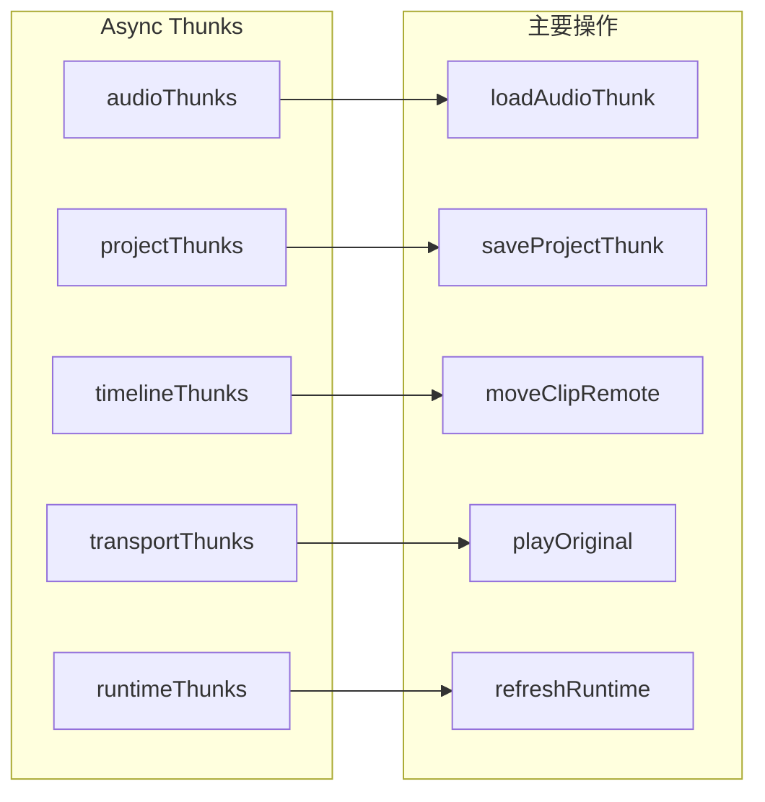

**主要 Thunks 列表：**

| Thunk 文件 | 主要函数 | 用途 |
|------------|----------|------|
| `audioThunks.ts` | pasteVocalShifterClipboard, pasteReaperClipboard | 剪贴板导入 |
| `projectThunks.ts` | newProjectRemote, saveProjectRemote, openProjectFromPath | 工程管理 |
| `timelineThunks.ts` | addTrackRemote, moveClipRemote, splitClipRemote, glueClipsRemote | 时间线操作 |
| `trackThunks.ts` | setTrackStateRemote, removeSelectedClipRemote | 轨道操作 |
| `transportThunks.ts` | playOriginal, seekPlayhead, stopAudioPlayback, syncPlaybackState | 播放控制 |
| `runtimeThunks.ts` | refreshRuntime, clearWaveformCacheRemote, loadUiSettings | 运行时状态 |

---

## 五、组件体系详解

### 5.1 组件层级关系

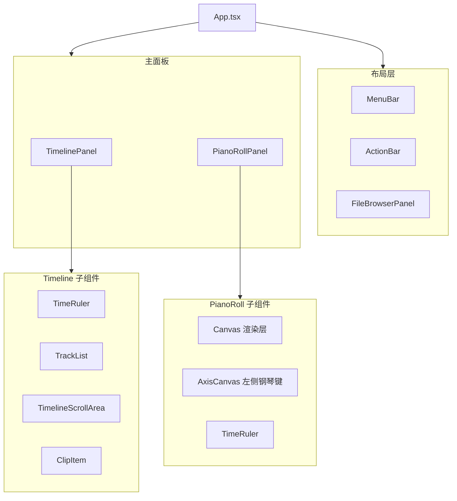

### 5.2 核心组件说明

#### TimelinePanel

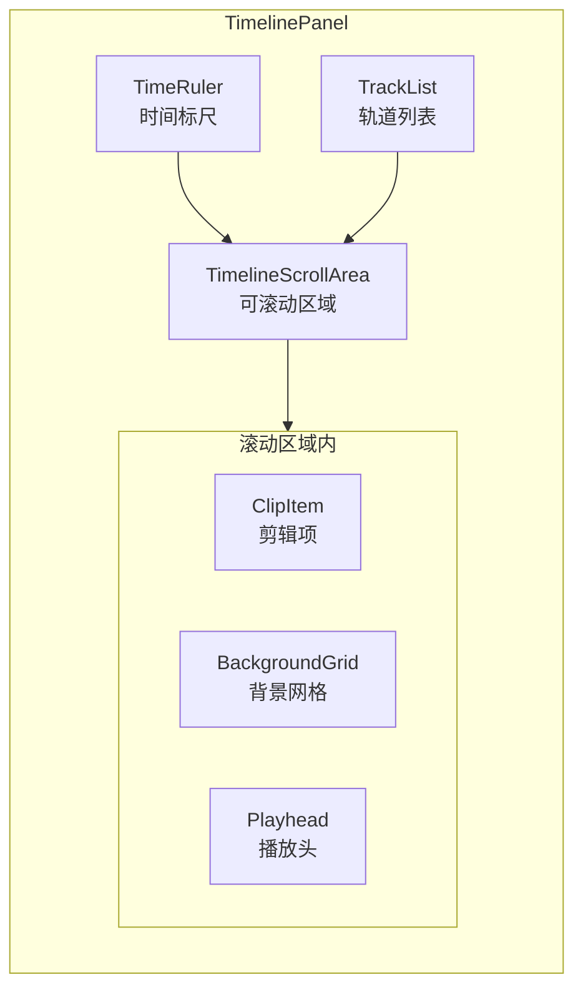

**主要功能：**
- 多轨道显示与管理（添加/删除/排序）
- 剪辑拖拽、裁剪、分割
- 波形渲染与缩放
- 播放头定位与拖拽

**关键 Hooks：**
- `useTimelineClips` - 剪辑数据管理
- `useTimelineDrag` - 剪辑拖拽逻辑
- `useSlipDrag` - Slip 编辑模式
- `useAutoCrossfade` - 自动交叉淡入淡出

#### PianoRollPanel

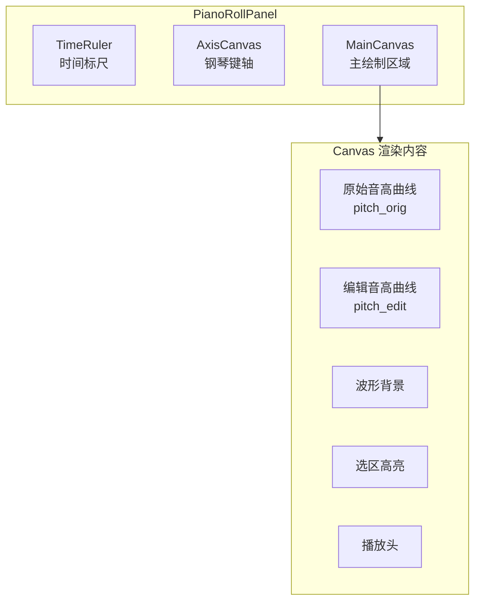

**主要功能：**
- 参数曲线编辑（Pitch/Tension/Breath/Volume）
- 绘制/选择/直线/颤音/擦除工具
- 选区操作与复制粘贴
- 音高吸附（半音/音阶）

**关键 Hooks：**
- `usePianoRollData` - 参数数据获取与缓存
- `usePianoRollInteractions` - 交互事件处理
- `useLiveParamEditing` - 实时编辑状态管理
- `useClipsPeaksForPianoRoll` - Per-clip 波形数据

---

## 六、API 服务层

### 6.1 服务层架构

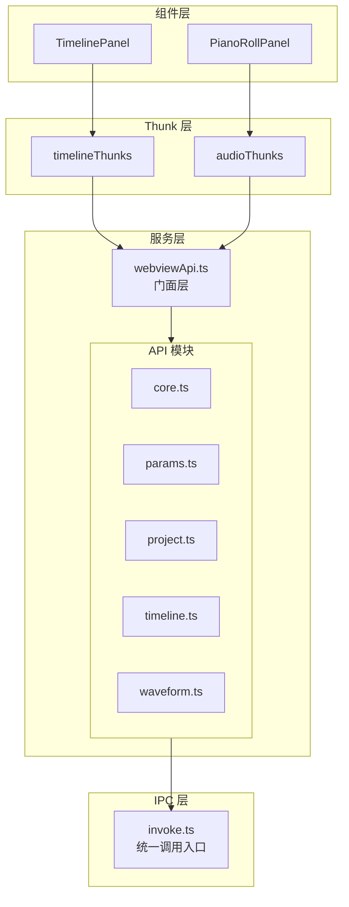

### 6.2 API 命令映射表

| 前端 API | 后端命令 | 用途 |
|----------|----------|------|
| `coreApi.getRuntimeInfo()` | `get_runtime_info` | 获取运行时状态 |
| `coreApi.playOriginal(startSec)` | `play_original` | 播放原始音频 |
| `projectApi.saveProject(path)` | `save_project` | 保存工程 |
| `timelineApi.addTrack()` | `add_track` | 添加轨道 |
| `timelineApi.moveClip(...)` | `move_clip` | 移动剪辑 |
| `paramsApi.getParamFrames(...)` | `get_param_frames` | 获取参数曲线 |
| `waveformApi.getWaveformPeaksSegment(...)` | `get_waveform_peaks_segment` | 获取波形数据 |

---

## 七、前端链路详解

### 7.1 UI 交互链路

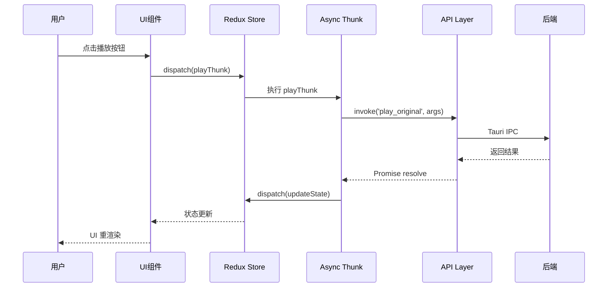

### 7.2 状态流转链路

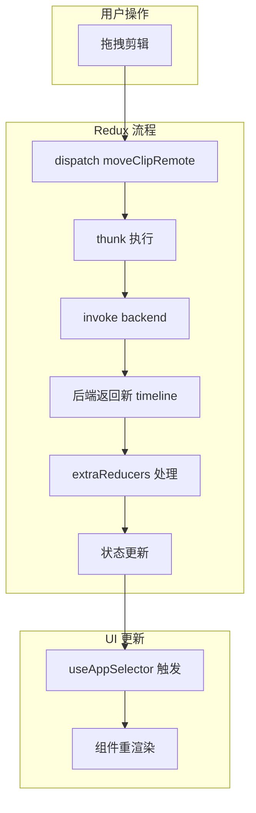

### 7.3 参数编辑链路

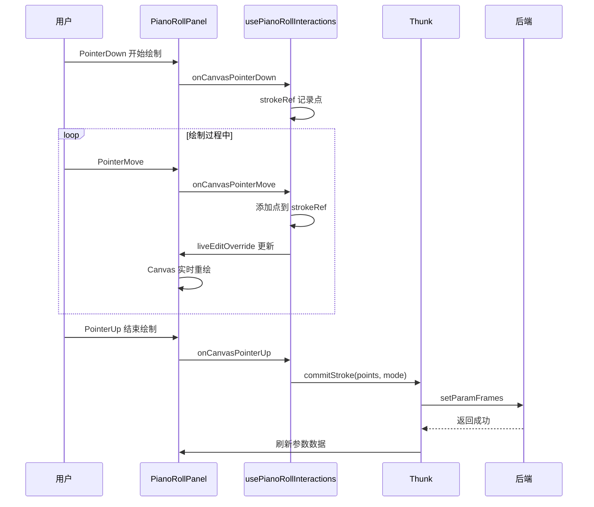

---

## 八、性能优化

### 8.1 渲染优化

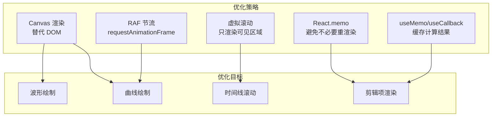

### 8.2 数据缓存

| 缓存位置 | 缓存内容 | 策略 |
|----------|----------|------|
| `clipWaveforms` | 波形预览数据 | Redux 状态缓存 |
| `clipPitchRanges` | 音高范围 | Redux 状态缓存 |
| sessionStorage | 波形 peaks 分段 | LRU 淘汰 (512条) |
| `peaksCache.ts` | Per-clip peaks | LRU 内存缓存 |

### 8.3 防抖节流

- **拖拽操作**：RAF 节流，每帧最多更新一次
- **缩放操作**：防抖 100ms
- **滚动同步**：RAF 节流
- **参数刷新**：防抖 50ms

---

## 九、快捷键系统

### 9.1 快捷键管理架构

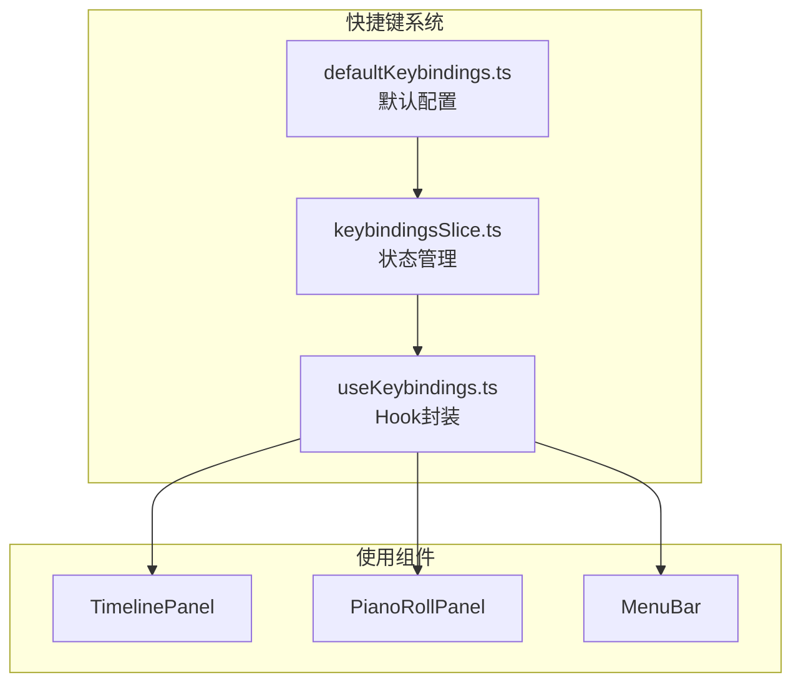

### 9.2 主要快捷键

| 快捷键 | 命令 | 用途 |
|--------|------|------|
| `Ctrl+Z` | undo | 撤销 |
| `Ctrl+Y` | redo | 重做 |
| `Ctrl+S` | saveProject | 保存工程 |
| `Space` | togglePlayback | 播放/暂停 |
| `Delete` | deleteSelected | 删除选中 |
| `Ctrl+C` | copy | 复制 |
| `Ctrl+V` | paste | 粘贴 |
| `D` | toolDraw | 绘制工具 |
| `S` | toolSelect | 选择工具 |
| `L` | toolLine | 直线工具 |
| `V` | toolVibrato | 颤音工具 |
| `E` | toolErase | 擦除工具 |

---

## 十、国际化

### 10.1 i18n 架构

```mermaid
flowchart TB
    subgraph I18n["国际化系统"]
        direction TB
        I1[I18nProvider.tsx<br/>Provider封装]
        I2[useI18n Hook<br/>获取翻译函数]
        
        subgraph Locales["语言包"]
            L1[zh-CN.ts]
            L2[en-US.ts]
            L3[ja-JP.ts]
            L4[ko-KR.ts]
        end
    end
    
    subgraph Usage["使用方式"]
        U1[const { t } = useI18n()]
        U2[t('key.path')]
    end
    
    I1 --> I2
    L1 --> I1
    L2 --> I1
    L3 --> I1
    L4 --> I1
    I2 --> U1
    U1 --> U2
```

### 10.2 语言包结构

```typescript
// zh-CN.ts 示例
export const zhCN = {
    common: {
        save: "保存",
        cancel: "取消",
        delete: "删除",
    },
    menu: {
        file: "文件",
        edit: "编辑",
        view: "视图",
    },
    timeline: {
        addTrack: "添加轨道",
        deleteTrack: "删除轨道",
    },
    pianoRoll: {
        pitch: "音高",
        tension: "张力",
    },
    // ...
};
```

---

## 十一、扩展指南

### 11.1 新增参数类型

1. 在 `sessionTypes.ts` 添加类型定义
2. 在 `sessionSlice.ts` 添加状态字段和 reducer
3. 在 `PianoRollPanel.tsx` 添加渲染逻辑
4. 在后端 `renderer/` 添加对应处理器

### 11.2 新增 UI 面板

1. 在 `components/` 下创建组件目录
2. 在 `features/` 下创建对应 Slice
3. 在 `services/api/` 添加 API 调用
4. 在 `App.tsx` 集成面板

### 11.3 新增 IPC 命令

1. 在 `services/api/` 下添加 API 函数
2. 在 `services/webviewApi.ts` 导出
3. 在 `features/*/thunks/` 创建 Thunk
4. 确保后端有对应命令处理

---

*文档由 AI 自动生成，如有疑问请参考源代码或联系开发者。*