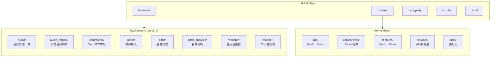
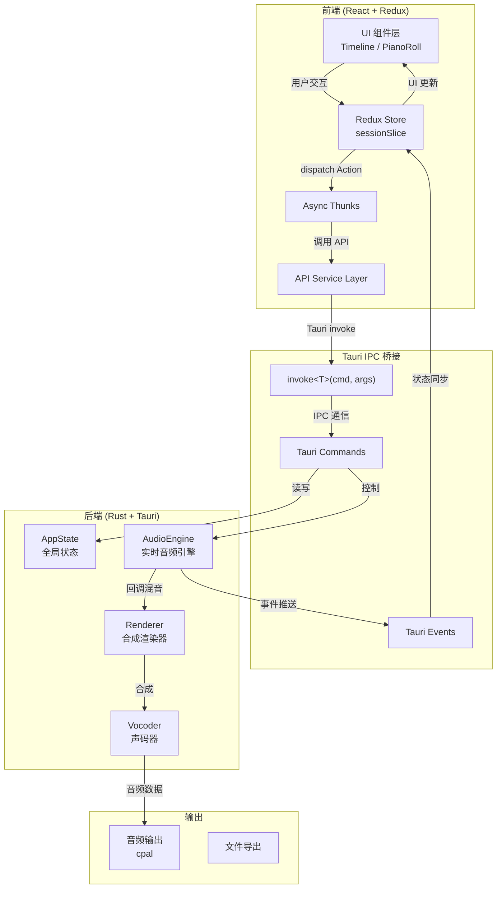
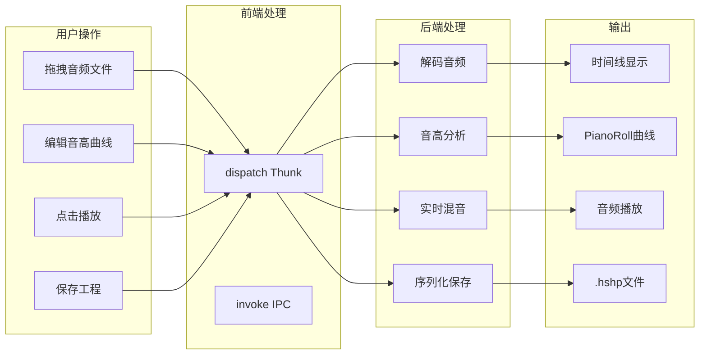
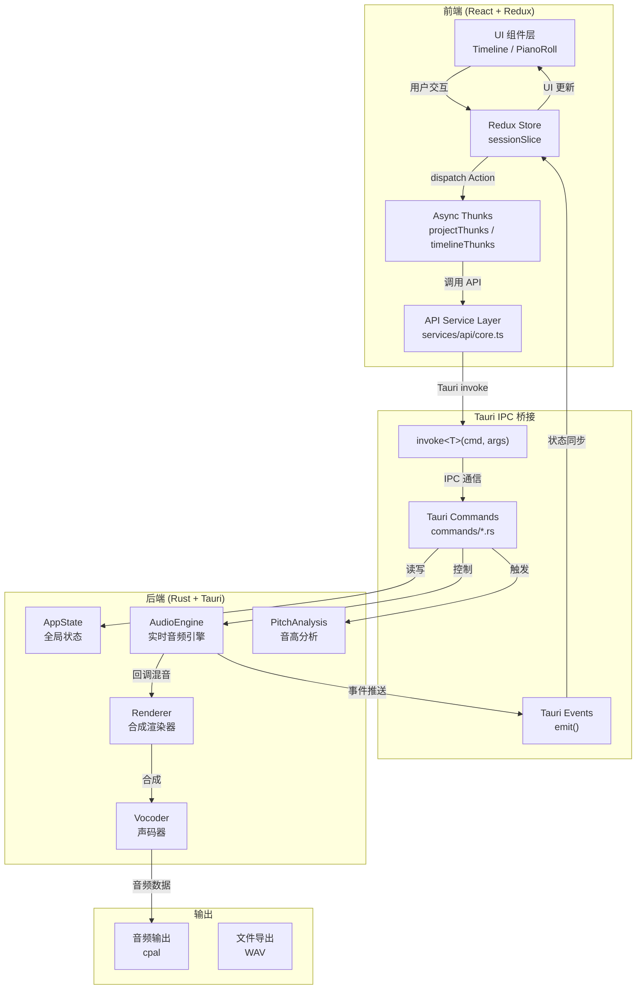

# HiFiShifter 项目结构分析

> 文档生成时间：2026-03-16  
> 项目版本：v0.1.0-beta.6

---

## 一、项目概述

**HiFiShifter** 是一个图形化人声编辑与合成工具，基于 **Tauri 2** 桌面应用框架构建，采用前后端分离架构：
- **前端**：React 19 + TypeScript + Redux Toolkit + Vite
- **后端**：Rust + Tauri 2 + cpal/rodio 音频引擎

核心功能包括音频加载、参数曲线编辑（音高/张力）、声码器合成、工程管理、实时播放混音等，适用于人力制作流程中的拼调一体化场景。

---

## 二、目录结构



### 后端核心模块

| 模块 | 路径 | 职责 |
|------|------|------|
| **audio** | `audio/` | 音频解码、波形提取、时间拉伸、混音合成 |
| **audio_engine** | `audio_engine/` | 实时音频播放引擎（cpal回调、混音） |
| **commands** | `commands/` | Tauri IPC命令入口（约60+命令） |
| **renderer** | `renderer/` | 统一渲染器接口（WORLD/HiFiGAN） |
| **vocoder** | `vocoder/` | 声码器实现（WORLD/NSF-HiFiGAN/vslib） |
| **pitch_analysis** | `pitch_analysis/` | 音高分析调度（Harvest/DIO） |

### 前端核心模块

| 模块 | 路径 | 职责 |
|------|------|------|
| **features/session** | `features/session/` | 核心会话状态管理（Redux Slice） |
| **components/layout** | `components/layout/` | 主要UI组件（Timeline/PianoRoll） |
| **services/api** | `services/api/` | Tauri IPC封装层 |
| **features/keybindings** | `features/keybindings/` | 快捷键管理 |

---

## 三、整体架构



---

## 四、技术栈

### 前端技术栈

| 层级 | 技术 | 版本 | 用途 |
|------|------|------|------|
| **UI框架** | React | 19.2.0 | 组件化UI开发 |
| **开发语言** | TypeScript | 5.9.3 | 类型安全 |
| **构建工具** | Vite | 7.3.1 | 开发服务器+打包 |
| **状态管理** | Redux Toolkit | 2.11.2 | 全局状态管理 |
| **UI组件库** | Radix UI Themes | 3.3.0 | 无障碍组件 |
| **样式方案** | Tailwind CSS | 3.4.17 | 原子化CSS |
| **桌面集成** | @tauri-apps/api | 2.0.0 | IPC通信 |

### 后端技术栈

| 模块 | 技术 | 用途 |
|------|------|------|
| **桌面框架** | Tauri 2 | 跨平台桌面应用 |
| **编程语言** | Rust | 后端核心逻辑 |
| **音频引擎** | cpal + rodio | 实时音频播放 |
| **声码器** | WORLD / NSF-HiFiGAN ONNX | 音高合成 |
| **时间拉伸** | Signalsmith Stretch | 高质量音频伸缩 |
| **音频解码** | symphonia + hound | 多格式音频支持 |
| **并行计算** | rayon | 多线程处理 |

---

## 五、核心链路概览



---

## 六、详细文档

- **[前端详细分析](./FRONTEND_ANALYSIS.md)**：前端架构、组件体系、状态管理、性能优化
- **[后端详细分析](./BACKEND_ANALYSIS.md)**：后端架构、音频引擎、声码器、缓存策略

---

*文档由 AI 自动生成，如有疑问请参考源代码或联系开发者。*

---

## 三、前端框架分析

### 3.1 技术栈概览

| 层级 | 技术选型 | 版本 | 用途 |
|------|----------|------|------|
| **UI 框架** | React | 19.2.0 | 组件化 UI 开发 |
| **开发语言** | TypeScript | 5.9.3 | 类型安全 |
| **构建工具** | Vite | 7.3.1 | 开发服务器 + 打包 |
| **状态管理** | Redux Toolkit | 2.11.2 | 全局状态管理 |
| **UI 组件库** | Radix UI Themes | 3.3.0 | 无障碍组件 |
| **样式方案** | Tailwind CSS | 3.4.17 | 原子化 CSS |
| **桌面集成** | @tauri-apps/api | 2.0.0 | 与 Rust 后端 IPC 通信 |

### 3.2 前端架构分层

```
┌─────────────────────────────────────────────────────────────┐
│                    UI 组件层 (components/)                   │
│  ┌─────────────┐  ┌─────────────┐  ┌─────────────────────┐  │
│  │   MenuBar   │  │ TimelinePanel│  │   PianoRollPanel   │  │
│  └─────────────┘  └─────────────┘  └─────────────────────┘  │
└───────────────────────────┬─────────────────────────────────┘
                            │
┌───────────────────────────▼─────────────────────────────────┐
│                  状态管理层 (features/session/)              │
│  ┌─────────────────────────────────────────────────────┐    │
│  │              sessionSlice (~94KB)                    │    │
│  │  - Timeline 状态  - Track 状态  - Clip 状态          │    │
│  │  - 播放状态       - 编辑状态  - 选区状态             │    │
│  └─────────────────────────────────────────────────────┘    │
│  ┌────────────────────┐  ┌────────────────────┐             │
│  │  keybindingsSlice  │  │  fileBrowserSlice  │             │
│  └────────────────────┘  └────────────────────┘             │
└───────────────────────────┬─────────────────────────────────┘
                            │
┌───────────────────────────▼─────────────────────────────────┐
│                   异步操作层 (thunks/)                       │
│  ┌──────────────┐ ┌──────────────┐ ┌──────────────────────┐ │
│  │ audioThunks  │ │ projectThunks│ │   timelineThunks     │ │
│  └──────────────┘ └──────────────┘ └──────────────────────┘ │
└───────────────────────────┬─────────────────────────────────┘
                            │
┌───────────────────────────▼─────────────────────────────────┐
│                   API 服务层 (services/api/)                 │
│  ┌─────────────────────────────────────────────────────┐    │
│  │                    core.ts                           │    │
│  │         Tauri invoke 封装 + 类型转换                  │    │
│  └─────────────────────────────────────────────────────┘    │
└───────────────────────────┬─────────────────────────────────┘
                            │
                            ▼
                  ┌─────────────────┐
                  │  Tauri IPC 层   │
                  │   (invoke)      │
                  └─────────────────┘
```

### 3.3 核心模块说明

#### 3.3.1 状态管理 (Redux)

**sessionSlice.ts** - 核心会话状态管理：
- **Timeline 状态**：时间线缩放、滚动位置、播放头位置
- **Track 状态**：轨道列表、轨道属性（静音/独奏/音量）、轨道层级
- **Clip 状态**：音频剪辑列表、选中状态、剪辑属性
- **播放状态**：播放/暂停、播放模式、循环设置
- **编辑状态**：当前编辑参数（Pitch/Tension）、编辑模式（Draw/Select）

**thunks/** - 异步操作层：
- `audioThunks.ts`：音频加载、波形获取
- `projectThunks.ts`：工程新建/打开/保存
- `timelineThunks.ts`：时间线操作（剪辑移动/裁剪/分割）
- `transportThunks.ts`：播放控制

#### 3.3.2 UI 组件

**TimelinePanel** - 时间线面板：
- 多轨道显示与管理
- 剪辑拖拽、裁剪、分割
- 波形渲染与缩放
- 播放头定位

**PianoRollPanel** - 钢琴卷帘面板：
- 参数曲线编辑（Pitch/Tension）
- 原始曲线/编辑曲线显示
- 选区操作与复制粘贴
- 波形背景预览

#### 3.3.3 API 服务层

**services/api/core.ts** - Tauri IPC 封装：
```typescript
// 统一的 invoke 封装，支持类型推断
export async function invoke<T>(cmd: string, args?: Record<string, unknown>): Promise<T>
```

**services/invoke.ts** - 类型化命令映射：
- 定义所有后端命令的类型签名
- 提供编译时类型检查

### 3.4 国际化 (i18n)

支持 4 种语言：
- `zh-CN.ts` - 简体中文
- `en-US.ts` - 英文
- `ja-JP.ts` - 日文
- `ko-KR.ts` - 韩文

通过 `I18nProvider.tsx` 提供全局 i18n 上下文。

---

## 四、后端框架分析

### 4.1 技术栈概览

| 模块 | 技术选型 | 用途 |
|------|----------|------|
| **桌面框架** | Tauri 2 | 跨平台桌面应用 |
| **编程语言** | Rust | 后端核心逻辑 |
| **音频引擎** | cpal + rodio | 实时音频播放 |
| **声码器** | WORLD / NSF-HiFiGAN ONNX | 音高合成 |
| **时间拉伸** | Signalsmith Stretch | 高质量音频伸缩 |
| **音频解码** | symphonia + hound | 多格式音频支持 |
| **并行计算** | rayon | 多线程处理 |
| **ONNX 推理** | ort | 神经网络推理 |

### 4.2 后端架构分层

```
┌─────────────────────────────────────────────────────────────┐
│                  Tauri Commands 层 (commands/)              │
│  ┌──────────┐ ┌──────────┐ ┌──────────┐ ┌──────────────┐   │
│  │ playback │ │ timeline │ │ project  │ │    params    │   │
│  └──────────┘ └──────────┘ └──────────┘ └──────────────┘   │
└───────────────────────────┬─────────────────────────────────┘
                            │
┌───────────────────────────▼─────────────────────────────────┐
│                   全局状态层 (state.rs)                      │
│  ┌─────────────────────────────────────────────────────┐    │
│  │                     AppState                         │    │
│  │  - Project: 工程/时间线/轨道/剪辑数据                │    │
│  │  - AudioEngine: 实时音频引擎实例                     │    │
│  │  - PitchAnalysis: 音高分析状态与缓存                 │    │
│  │  - UndoStack/RedoStack: 撤销重做栈                   │    │
│  └─────────────────────────────────────────────────────┘    │
└───────────────────────────┬─────────────────────────────────┘
                            │
┌───────────────────────────▼─────────────────────────────────┐
│                   业务逻辑层                                │
│  ┌────────────┐ ┌─────────────┐ ┌──────────────────────┐   │
│  │ pitch/     │ │ pitch_editing│ │    import/          │   │
│  │ (音高处理) │ │ (音高编辑)   │ │    (项目导入)       │   │
│  └────────────┘ └─────────────┘ └──────────────────────┘   │
└───────────────────────────┬─────────────────────────────────┘
                            │
┌───────────────────────────▼─────────────────────────────────┐
│                   音频引擎层 (audio_engine/)                 │
│  ┌─────────────────────────────────────────────────────┐    │
│  │                    engine.rs                         │    │
│  │  - 低延迟音频回调（cpal 输出流）                      │    │
│  │  - 多轨道实时混音                                    │    │
│  │  - 播放状态管理（播放/暂停/定位）                     │    │
│  │  - 资源预加载与缓存                                  │    │
│  └─────────────────────────────────────────────────────┘    │
└───────────────────────────┬─────────────────────────────────┘
                            │
┌───────────────────────────▼─────────────────────────────────┐
│                   渲染/声码器层 (renderer/ + vocoder/)       │
│  ┌──────────────┐ ┌───────────────┐ ┌──────────────────┐   │
│  │ WORLD 声码器 │ │ HiFiGAN ONNX  │ │   vslib (FFI)    │   │
│  │ (高质量语音) │ │ (神经网络)    │ │   (VocalShifter) │   │
│  └──────────────┘ └───────────────┘ └──────────────────┘   │
└───────────────────────────┬─────────────────────────────────┘
                            │
┌───────────────────────────▼─────────────────────────────────┐
│                   音频处理层 (audio/)                        │
│  ┌──────────────┐ ┌───────────────┐ ┌──────────────────┐   │
│  │ mixdown.rs   │ │ sstretch.rs   │ │  waveform.rs     │   │
│  │ (混音合成)   │ │ (时间拉伸)    │ │  (波形提取)      │   │
│  └──────────────┘ └───────────────┘ └──────────────────┘   │
└─────────────────────────────────────────────────────────────┘
```

### 4.3 核心模块说明

#### 4.3.1 Commands 层

负责接收前端 IPC 调用，是前后端通信的入口：

| 模块文件 | 主要命令 | 功能 |
|---------|---------|------|
| `playback.rs` | play, pause, seek, stop | 播放控制 |
| `timeline.rs` | move_clip, resize_clip, split_clip | 时间线操作 |
| `project.rs` | new_project, save_project, load_project | 工程管理 |
| `params.rs` | get_pitch_curve, set_pitch_curve | 参数编辑 |
| `waveform.rs` | get_waveform_peaks | 波形数据获取 |
| `pitch_refresh_async.rs` | refresh_pitch_analysis | 异步音高分析 |

#### 4.3.2 AppState (state.rs)

全局状态管理，包含：
- **Project**：工程数据（时间线、轨道、剪辑、BPM）
- **AudioEngine**：实时音频引擎实例
- **PitchAnalysis**：音高分析状态、缓存、进度
- **UndoStack/RedoStack**：撤销/重做栈

#### 4.3.3 AudioEngine (audio_engine/)

实时音频播放引擎：

**核心特性**：
- 基于 `cpal` 的低延迟音频回调
- 多轨道实时混音
- 支持播放速率调整（时间拉伸）
- 异步资源预加载（避免播放卡顿）

**关键文件**：
- `engine.rs`：核心引擎逻辑
- `mix.rs`：混音算法
- `snapshot.rs`：播放状态快照

#### 4.3.4 Vocoder (vocoder/)

声码器实现，支持多种合成方案：

| 声码器 | 文件 | 特点 |
|--------|------|------|
| **WORLD** | `world.rs`, `streaming_world.rs` | 高质量语音分析合成，支持流式 |
| **NSF-HiFiGAN** | `nsf_hifigan_onnx.rs` | 神经网络声码器，ONNX 推理 |
| **vslib** | `vslib.rs` | VocalShifter 库 FFI 调用 |

#### 4.3.5 Renderer (renderer/)

统一渲染器接口：
- `traits.rs`：定义 `Renderer` trait
- `chain.rs`：渲染链管理
- `vslib_processor.rs`：vslib 处理器封装

### 4.4 音频处理依赖

```toml
# 音频核心
rodio = "0.20"           # 音频播放抽象
cpal = "0.15"            # 低级音频 I/O
symphonia = "0.5"        # 多格式解码 (AAC/FLAC/MP3/OGG/WAV)
hound = "3"              # WAV 读写

# 声码器
ort = "2.0.0-rc.11"      # ONNX Runtime (可选, CUDA 支持)

# 并行计算
rayon = "1.7"            # 数据并行

# 缓存
lru = "0.12"             # LRU 缓存
blake3 = "1"             # 哈希（缓存键生成）
```

---

## 五、链路分析

### 5.1 整体数据流



### 5.2 核心链路详解

#### 5.2.1 音频加载链路

```
用户拖拽音频文件
    │
    ▼
frontend: onDrop → dispatch(loadAudioThunk)
    │
    ▼
frontend: invoke('load_audio', { path })
    │
    ▼
[Tauri IPC]
    │
    ▼
backend: commands::load_audio()
    │
    ├─→ symphonia 解码音频
    ├─→ 提取波形 peaks (waveform.rs)
    ├─→ 缓存波形到磁盘 (waveform_disk_cache.rs)
    └─→ 返回 ClipInfo
    │
    ▼
frontend: dispatch(addClipAction)
    │
    ▼
UI 更新: 时间线显示新剪辑
```

#### 5.2.2 播放链路

```
用户点击播放按钮
    │
    ▼
frontend: dispatch(playThunk)
    │
    ▼
frontend: invoke('play', { fromPosition })
    │
    ▼
[Tauri IPC]
    │
    ▼
backend: commands::play(state, from_position)
    │
    ▼
backend: AudioEngine.play()
    │
    ├─→ 创建播放快照 (snapshot.rs)
    ├─→ 异步预加载音频资源 (resource_manager.rs)
    └─→ 启动 cpal 输出流回调
    │
    ▼
[cpal 音频回调线程]
    │
    ├─→ 获取当前播放快照
    ├─→ 遍历活跃轨道/剪辑
    ├─→ 读取音频数据 (考虑播放速率)
    ├─→ 应用音量/静音/独奏
    ├─→ 混音到输出缓冲区 (mix.rs)
    │
    ├─→ [如果启用了合成]
    │       └─→ Renderer.process() → Vocoder.synthesize()
    │
    └─→ 输出到音频设备
    │
    ▼
实时音频播放
```

#### 5.2.3 音高编辑链路

```
用户在 PianoRoll 绘制曲线
    │
    ▼
frontend: onMouseMove → dispatch(setPitchCurveThunk)
    │
    ▼
frontend: invoke('set_pitch_curve', { clipId, points })
    │
    ▼
[Tauri IPC]
    │
    ▼
backend: commands::set_pitch_curve()
    │
    ├─→ 更新 AppState 中 Clip 的 pitch_edit
    ├─→ 标记合成缓存为脏
    └─→ 记录 Undo 操作
    │
    ▼
[下次播放/合成时]
    │
    ▼
backend: Renderer 使用新的 pitch_edit 合成
    │
    ▼
输出变调后的音频
```

#### 5.2.4 音高分析链路

```
用户开启根轨道合成开关 (C)
    │
    ▼
frontend: dispatch(enableSynthesisThunk)
    │
    ▼
frontend: invoke('refresh_pitch_analysis', { rootTrackId })
    │
    ▼
[Tauri IPC]
    │
    ▼
backend: commands::refresh_pitch_analysis()
    │
    ▼
backend: PitchAnalysisScheduler.schedule()
    │
    ├─→ 检查缓存 (clip_pitch_cache.rs)
    │       └─→ 缓存命中：直接返回
    │
    ├─→ [缓存未命中]
    │       ├─→ 计算缓存键 (blake3 哈希)
    │       ├─→ 多线程并行分析 (rayon)
    │       │       ├─→ WORLD/DIO 提取 F0
    │       │       └─→ 或 ONNX 模型推理
    │       └─→ 存入 LRU 缓存
    │
    ├─→ 发送进度事件
    │       └─→ emit('pitch-analysis-progress', { percent })
    │
    └─→ 返回 pitch_orig 数据
    │
    ▼
frontend: 监听进度事件 → 更新进度条
    │
    ▼
frontend: 接收 pitch_orig → 更新 PianoRoll 显示
```

#### 5.2.5 工程保存链路

```
用户点击保存 (Ctrl+S)
    │
    ▼
frontend: dispatch(saveProjectThunk)
    │
    ▼
frontend: invoke('save_project', { path })
    │
    ▼
[Tauri IPC]
    │
    ▼
backend: commands::save_project()
    │
    ├─→ 序列化 Project 结构
    │       ├─→ 时间线数据
    │       ├─→ 轨道/剪辑数据
    │       ├─→ 音高曲线数据
    │       └─→ 编辑参数
    │
    └─→ 写入 .hshp 文件 (JSON)
    │
    ▼
backend: 清除未保存标记
    │
    ▼
frontend: 更新 UI 标题（移除 * 标记）
```

### 5.3 前后端通信协议

#### 5.3.1 IPC 命令模式

**前端调用**：
```typescript
import { invoke } from '@tauri-apps/api/core';

// 类型化调用
const clips = await invoke<ClipInfo[]>('get_clips', { 
    trackId: 'track-001' 
});
```

**后端处理**：
```rust
#[tauri::command]
async fn get_clips(track_id: String, state: State<'_, AppState>) -> Result<Vec<ClipInfo>, String> {
    let project = state.project.read().await;
    // ... 处理逻辑
    Ok(clips)
}
```

#### 5.3.2 事件推送模式

**后端推送**：
```rust
app_handle.emit("pitch-analysis-progress", ProgressPayload {
    percent: 50,
    clip_id: "clip-001".to_string(),
})?;
```

**前端监听**：
```typescript
import { listen } from '@tauri-apps/api/event';

const unlisten = await listen<ProgressPayload>('pitch-analysis-progress', (event) => {
    setProgress(event.payload.percent);
});
```

### 5.4 关键性能优化

#### 5.4.1 前端优化

1. **虚拟滚动**：时间线/PianoRoll 只渲染可见区域
2. **Canvas 渲染**：波形/曲线使用 Canvas 而非 DOM
3. **防抖节流**：拖拽/缩放操作防抖处理
4. **React.memo**：避免不必要的组件重渲染

#### 5.4.2 后端优化

1. **波形磁盘缓存**：避免重复计算 peaks
2. **音高 LRU 缓存**：100 clips 容量，~95% 命中率
3. **并行分析**：rayon 多线程处理多个 clips
4. **增量刷新**：只重新分析变化的 clips
5. **异步预加载**：播放前预加载音频资源

---

## 六、总结

### 架构特点

| 特点 | 说明 |
|------|------|
| **前后端分离** | React 前端 + Rust 后端，通过 Tauri IPC 通信 |
| **实时音频** | cpal 低延迟回调，独立音频线程 |
| **多声码器支持** | WORLD / HiFiGAN / vslib 可切换 |
| **增量处理** | 缓存 + 增量刷新，避免全量重计算 |
| **跨平台** | Tauri 2 支持 Windows/macOS/Linux |

### 扩展建议

1. **新增参数类型**：继承 `Renderer` trait，在 `pitch_config.rs` 扩展
2. **新增声码器**：实现 `Vocoder` trait，在 `renderer/chain.rs` 注册
3. **新增导入格式**：在 `import/` 模块添加解析器
4. **新增 UI 面板**：遵循 `features/` 的 Slice + Thunks 模式

---

*文档由 AI 自动生成，如有疑问请参考源代码或联系开发者。*
