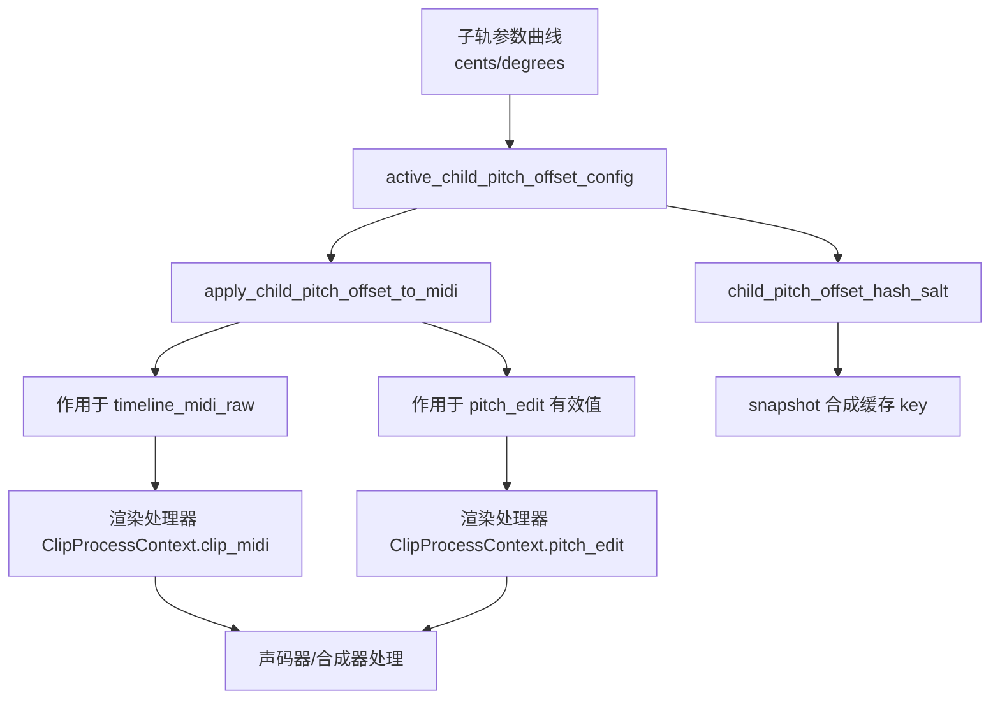

# HifiShifter 子轨音分差与度数差作用逻辑报告

日期：2026-04-01

## 1. 结论先行

- 音分差与度数差是子轨相对根轨的二级音高偏移参数，只在子轨生效。
- 实际计算顺序是：先按工程音阶应用度数差，再叠加音分差。
- 两者不仅作用在原始时间线音高曲线，也会作用在用户编辑曲线，确保听感与可视编辑一致。
- 度数差依赖工程音阶 project_scale_notes，因此改音阶会改变同一度数差的实际半音结果。
- 引擎把子轨偏移纳入渲染缓存哈希，避免“参数变了但缓存没失效”的问题。

相关实现位置：

- [backend/src-tauri/src/pitch_editing.rs](backend/src-tauri/src/pitch_editing.rs)
- [backend/src-tauri/src/audio_engine/snapshot.rs](backend/src-tauri/src/audio_engine/snapshot.rs)
- [backend/src-tauri/src/commands/params.rs](backend/src-tauri/src/commands/params.rs)
- [frontend/src/components/layout/pianoRoll/childPitchOffsetParams.ts](frontend/src/components/layout/pianoRoll/childPitchOffsetParams.ts)
- [frontend/src/utils/musicalScales.ts](frontend/src/utils/musicalScales.ts)
- [frontend/src/components/layout/PianoRollPanel.tsx](frontend/src/components/layout/PianoRollPanel.tsx)
- [USERMANUAL.md](USERMANUAL.md)

## 2. 参数含义与生效条件

### 2.1 参数定义

- 音分差：child_pitch_offset_cents@{trackId}
- 度数差：child_pitch_offset_degrees@{trackId}

这两个参数是 extra_curves 的一部分，挂在根轨参数容器下，但按子轨 trackId 区分。

### 2.2 生效前提

后端会先做 active_child_pitch_offset_config 判定：

1. 当前轨必须是子轨（存在 parent_id）。
2. 对应曲线存在且在任意范围内偏离默认值（默认均为 0）。
3. 任一曲线有效即可触发偏移配置。

逻辑入口：

- [backend/src-tauri/src/pitch_editing.rs](backend/src-tauri/src/pitch_editing.rs)

## 3. 计算核心

## 3.1 计算顺序

对每一帧 MIDI：

1. 读取度数差（可为曲线采样值）。
2. 以工程音阶为参考，做按度数移调。
3. 再读取音分差（可为曲线采样值），按 $cents / 100$ 转成半音叠加。

对应函数：

- apply_child_pitch_offset_to_midi
- transpose_midi_by_scale_steps

实现文件：

- [backend/src-tauri/src/pitch_editing.rs](backend/src-tauri/src/pitch_editing.rs)

### 3.2 数学表达

设原始音高为 $m$（单位：MIDI 半音），度数差内部步长为 $d$，音分差为 $c$（单位：cent）：

$$
\text{shifted} = T_{scale}(m, d)
$$

$$
\text{result} = \text{shifted} + \frac{c}{100}
$$

其中 $T_{scale}(m, d)$ 不是简单加减半音，而是先找音阶锚点，再在锚点间按相对位置插值。

## 3.3 度数差不是“固定半音差”

在大调七声音阶里，跨一个度通常对应 1 或 2 个半音，取决于当前所在级与目标级。

因此同样是 +1 步，在不同音高处得到的半音偏移可能不同，这也是“和声内移调”而非“等半音移调”的核心特征。

## 4. 前端输入与内部值映射

前端展示给用户的“度数”与内部步长并非一一同号：

- 输入 0/1/-1 会映射到内部 0（不移调）。
- 输入 +3 映射内部 +2。
- 输入 -3 映射内部 -2。

这是为了贴合乐理上“1 度视为原位”的表达习惯。

对应实现：

- degreeInputToScaleSteps
- scaleStepsToDegreeDisplay

实现文件：

- [frontend/src/utils/musicalScales.ts](frontend/src/utils/musicalScales.ts)
- [frontend/src/components/layout/pianoRoll/childPitchOffsetParams.ts](frontend/src/components/layout/pianoRoll/childPitchOffsetParams.ts)

## 5. 在音频处理链中的作用位置

关键点：

- 原始曲线与编辑曲线都被偏移，避免“看起来变了、听起来没变”或反之。
- 子轨偏移会影响渲染缓存键，确保参数变化能触发重渲染。

实现位置：

- [backend/src-tauri/src/pitch_editing.rs](backend/src-tauri/src/pitch_editing.rs)
- [backend/src-tauri/src/audio_engine/snapshot.rs](backend/src-tauri/src/audio_engine/snapshot.rs)

## 6. 与缓存一致性相关的关键逻辑

后端会计算 child_pitch_offset_hash_salt，并把它混入渲染哈希。

特别注意：

- 若存在度数差曲线，哈希还会把 project_scale_notes 一并纳入。
- 这意味着修改工程音阶后，即使曲线没改，也会触发对应缓存失效并重渲染。

这点设计是正确且必要的，否则会出现“音阶已改但缓存仍按旧音阶播放”的错误。

## 7. 交互与参数范围

当前前端约束：

- 音分差范围：[-2400, 2400]
- 度数差内部范围：[-14, 14]
- 音分差吸附步进：100 cents
- 度数差吸附步进：1 step

界面切换入口在 PianoRoll 顶部按钮组，仅当选中子轨时显示。

实现位置：

- [frontend/src/components/layout/pianoRoll/childPitchOffsetParams.ts](frontend/src/components/layout/pianoRoll/childPitchOffsetParams.ts)
- [frontend/src/components/layout/PianoRollPanel.tsx](frontend/src/components/layout/PianoRollPanel.tsx)

## 8. 示例说明

假设工程音阶为 C 大调，某帧原始 MIDI 为 64（E4）：

- 度数差 +2（内部步长）后，目标趋向 G4 附近（按音阶级进）。
- 再叠加音分差 -25，则最终为该目标减 0.25 半音。

如果把工程音阶改为 D 大调，同样的度数差在部分音高点会映射到不同半音落点，因此最终曲线会变化。

## 9. 潜在注意点

- 当前静态默认值在后端为 0，实际以曲线差异判定是否生效；若未来要支持“固定常量偏移”，需补充 static_cents/static_degree_steps 的读取来源。
- 度数差前端显示值与内部步长不同，导入导出或脚本接口要统一使用内部步长，避免 UI 值直传导致偏差。

## 10. 参考文档

- 用户手册中对子轨音分差/度数差的说明见：
  - [USERMANUAL.md](USERMANUAL.md)
