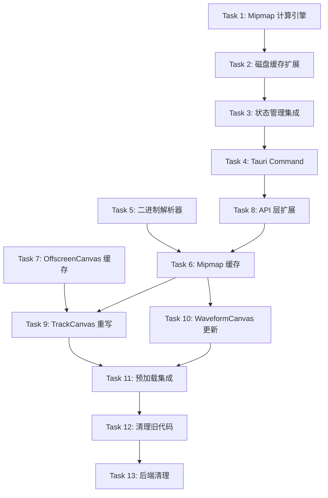

# 波形渲染系统重构 实施计划

> **For Claude:** REQUIRED SUB-SKILL: Use superpowers:executing-plans to implement this plan task-by-task.

**Goal:** 重构波形渲染系统，采用三级 mipmap 缓存 + OffscreenCanvas + 二进制传输，实现高性能波形渲染

**Architecture:** Rust 后端使用 Symphonia 解码音频，预生成三级 min/max 摘要（L0/L1/L2），通过 Tauri Command 以 `Vec<u8>` 二进制格式传输到前端。前端采用整文件缓存策略，每条轨道一个主 Canvas + 每 Clip 一个 OffscreenCanvas 缓存，React useEffect 驱动渲染，Redux 管理结构数据 + useRef 管理渲染数据。

**Tech Stack:** Rust (Symphonia, Tauri v2) / TypeScript (React, Redux, Canvas API, OffscreenCanvas)

---

## 设计决策汇总（Brainstorming 10 题）

| # | 决策项 | 选择 |
|---|--------|------|
| 1 | 精度需求 | 一般性精细对轨（div=64 够用，不需要样本级） |
| 2 | 数据传输 | Tauri Command 返回 `Vec<u8>` 二进制通道 |
| 3 | Canvas 架构 | 每 Track 一个主 Canvas + 每 Clip 一个 OffscreenCanvas |
| 4 | 缓存级数 | 三级（L0 div=64, L1 div=512, L2 div=4096） |
| 5 | 前端缓存策略 | 整文件缓存（一次性加载，Float32Array 持有） |
| 6 | 传输方案 | 方案 A（Tauri Command `Vec<u8>` + `Float32Array`） |
| 7 | 离屏缓存 + 渲染驱动 | OffscreenCanvas 缓存 + useEffect 驱动 |
| 8 | 绘制样式 + 颜色 | 镜像条形图（Bar Mode） + 跟随轨道颜色 |
| 9 | 传输协议 | Binary Response（`Vec<u8>` + `Float32Array`） |
| 10 | 状态管理 | Redux（结构数据）+ useRef（渲染数据）混合管理 |

---

## 三级 Mipmap 参数表

| 级别 | div | 每数据点 | 适用场景 | 3分钟@44.1kHz 数据量 | 切换阈值 |
|------|-----|---------|---------|---------------------|---------|
| L0 | 64 | 每 64 采样 → 1 对 (min, max) | 近距离精细对轨 | ~124,000 对 ≈ 1MB | spp ≤ 256 |
| L1 | 512 | 每 512 采样 → 1 对 (min, max) | 中等缩放编辑 | ~15,500 对 ≈ 124KB | 256 < spp ≤ 2048 |
| L2 | 4096 | 每 4096 采样 → 1 对 (min, max) | 全局预览/导航 | ~1,940 对 ≈ 16KB | spp > 2048 |

> spp = samples_per_pixel = sample_rate / pixels_per_second

---

## 二进制传输协议

### 请求（Tauri Command 参数）

```
get_waveform_peaks_binary(source_path: String, level: u8) -> Vec<u8>
```

### 响应格式（`Vec<u8>` 字节流）

```
[Header (20 bytes)] [min_data] [max_data]

Header:
  bytes 0-3:   magic "WFPK" (4 bytes)
  bytes 4-7:   sample_rate (u32, little-endian)
  bytes 8-11:  division_factor (u32, little-endian)
  bytes 12-15: peak_count (u32, little-endian)
  bytes 16-19: level (u32, little-endian)

min_data: peak_count × f32 (little-endian)
max_data: peak_count × f32 (little-endian)
```

### 前端解析

```typescript
const view = new DataView(buffer);
const sampleRate = view.getUint32(4, true);
const divFactor = view.getUint32(8, true);
const count = view.getUint32(12, true);
const level = view.getUint32(16, true);
const min = new Float32Array(buffer, 20, count);
const max = new Float32Array(buffer, 20 + count * 4, count);
```

---

## 文件变更清单

### 后端（Rust）

| 操作 | 文件路径 | 说明 |
|------|---------|------|
| 新建 | `backend/src-tauri/src/audio/waveform_mipmap.rs` | 三级 mipmap 计算引擎 |
| 修改 | `backend/src-tauri/src/audio/waveform_disk_cache.rs` | 扩展磁盘缓存支持三级 mipmap 格式（HFSPEAKSv2） |
| 修改 | `backend/src-tauri/src/commands/waveform.rs` | 新增二进制传输 Command |
| 修改 | `backend/src-tauri/src/commands.rs` | 注册新 Command |
| 修改 | `backend/src-tauri/src/lib.rs` | 注册新 Command 到 Tauri |
| 修改 | `backend/src-tauri/src/state.rs` | 新增 mipmap 缓存状态管理方法 |

### 前端（TypeScript/React）

| 操作 | 文件路径 | 说明 |
|------|---------|------|
| 新建 | `frontend/src/utils/waveformBinaryCodec.ts` | 二进制协议解析器 |
| 新建 | `frontend/src/utils/waveformMipmapStore.ts` | 整文件级 mipmap 缓存（三级 Float32Array） |
| 新建 | `frontend/src/utils/offscreenCanvasCache.ts` | OffscreenCanvas 缓存管理器 |
| 重写 | `frontend/src/components/waveform/WaveformTrackCanvas.tsx` | 使用 OffscreenCanvas + 新缓存 |
| 修改 | `frontend/src/services/api/waveform.ts` | 新增二进制 API 调用 |
| 修改 | `frontend/src/services/invoke.ts` | 新增二进制 invoke 方法（如需） |
| 废弃 | `frontend/src/utils/mipmapCache.ts` | 旧缓存管理器（最后清理时移除） |
| 废弃 | `frontend/src/utils/basePeaksManager.ts` | 旧 base peaks 管理器（最后清理时移除） |
| 废弃 | `frontend/src/utils/waveformDataAdapter.ts` | waveform-data.js 适配层（不再需要） |

---

## 任务分解

### Task 1: 后端 - 三级 Mipmap 计算引擎

**目标：** 创建 Rust 模块，从音频文件计算三级 min/max 摘要数据

**Files:**
- Create: `backend/src-tauri/src/audio/waveform_mipmap.rs`
- Modify: `backend/src-tauri/src/audio/mod.rs`（如有，添加 mod 声明）

**Step 1: 创建 waveform_mipmap.rs**

核心数据结构：
```rust
/// 三级 Mipmap 计算引擎
///
/// 从音频文件生成三级 min/max 摘要：
/// - L0 (div=64):   精细级，近距离对轨
/// - L1 (div=512):  中间级，日常编辑
/// - L2 (div=4096): 全局级，预览/导航

/// 单级摘要数据
pub struct MipmapLevel {
    pub division_factor: u32,
    pub min: Vec<f32>,
    pub max: Vec<f32>,
}

/// 三级 Mipmap 数据
pub struct MipmapData {
    pub sample_rate: u32,
    pub total_frames: u64,
    pub levels: [MipmapLevel; 3],  // L0, L1, L2
}

const DIV_FACTORS: [u32; 3] = [64, 512, 4096];
```

计算逻辑：
1. 使用 Symphonia 解码音频为 PCM 采样（复用现有 `audio_utils.rs` 的解码逻辑）
2. 先计算 L0（div=64），遍历所有采样，每 64 个采样取 min/max
3. 从 L0 下采样生成 L1：每 8 个 L0 数据点聚合为 1 个 L1 数据点（512/64=8）
4. 从 L1 下采样生成 L2：每 8 个 L1 数据点聚合为 1 个 L2 数据点（4096/512=8）

二进制序列化方法：
```rust
impl MipmapData {
    /// 将指定级别的数据序列化为二进制格式
    pub fn to_binary(&self, level: usize) -> Vec<u8> {
        let lvl = &self.levels[level];
        let count = lvl.min.len();
        let mut buf = Vec::with_capacity(20 + count * 8);
        
        // Header (20 bytes)
        buf.extend_from_slice(b"WFPK");
        buf.extend_from_slice(&self.sample_rate.to_le_bytes());
        buf.extend_from_slice(&lvl.division_factor.to_le_bytes());
        buf.extend_from_slice(&(count as u32).to_le_bytes());
        buf.extend_from_slice(&(level as u32).to_le_bytes());
        
        // min data
        for &v in &lvl.min {
            buf.extend_from_slice(&v.to_le_bytes());
        }
        // max data
        for &v in &lvl.max {
            buf.extend_from_slice(&v.to_le_bytes());
        }
        
        buf
    }
}
```

**Step 2: 添加 mod 声明**

在 `audio/` 模块中注册新文件。

**Step 3: 编译验证**

Run: `cd backend/src-tauri && cargo check`
Expected: 编译通过，无错误

---

### Task 2: 后端 - 磁盘缓存扩展

**目标：** 扩展现有磁盘缓存，支持三级 mipmap 格式的序列化/反序列化

**Files:**
- Modify: `backend/src-tauri/src/audio/waveform_disk_cache.rs`

**Step 1: 新增 v2 缓存格式**

```
文件格式 HFSPEAKSv2:
  [8 bytes] magic "HFSPKS02"
  [4 bytes] version (u32)
  [4 bytes] sample_rate (u32)
  [8 bytes] total_frames (u64)
  [4 bytes] level_count (u32) = 3
  
  For each level:
    [4 bytes] division_factor (u32)
    [4 bytes] peak_count (u32)
    [peak_count * 4 bytes] min data (f32[])
    [peak_count * 4 bytes] max data (f32[])
```

**Step 2: 实现 save/load 函数**

```rust
pub fn save_mipmap(path: &Path, data: &MipmapData) -> Result<(), String>;
pub fn try_load_mipmap(path: &Path) -> Option<MipmapData>;
pub fn mipmap_cache_file_path(cache_dir: &Path, source_path: &str) -> PathBuf;
```

**Step 3: 编译验证**

Run: `cd backend/src-tauri && cargo check`

---

### Task 3: 后端 - 状态管理集成

**目标：** 在 AppState 中集成 mipmap 数据的内存缓存 + 磁盘缓存

**Files:**
- Modify: `backend/src-tauri/src/state.rs`

**Step 1: 添加内存缓存字段**

在 AppState 中添加：
```rust
/// 三级 mipmap 波形缓存 (source_path -> MipmapData)
waveform_mipmap_cache: Mutex<HashMap<String, Arc<MipmapData>>>
```

**Step 2: 实现 get_or_compute 方法**

```rust
impl AppState {
    pub fn get_or_compute_waveform_mipmap(
        &self, source_path: &str
    ) -> Result<Arc<MipmapData>, String> {
        // 1. 检查内存缓存
        // 2. 检查磁盘缓存
        // 3. 计算并存入两级缓存
    }
}
```

**Step 3: 编译验证**

Run: `cd backend/src-tauri && cargo check`

---

### Task 4: 后端 - Tauri Command 二进制接口

**目标：** 新增返回 `Vec<u8>` 的 Tauri Command

**Files:**
- Modify: `backend/src-tauri/src/commands/waveform.rs`
- Modify: `backend/src-tauri/src/commands.rs`
- Modify: `backend/src-tauri/src/lib.rs`

**Step 1: 新增 Command 函数**

```rust
/// 获取指定级别的波形 mipmap 数据（二进制格式）
///
/// 返回 Vec<u8>，Tauri 会自动以二进制通道传输，
/// 前端收到 ArrayBuffer，通过 Float32Array 视图直接读取。
pub(super) fn get_waveform_mipmap_binary(
    state: State<'_, AppState>,
    source_path: String,
    level: u8,
) -> Vec<u8> {
    let level = (level as usize).min(2);
    match state.get_or_compute_waveform_mipmap(&source_path) {
        Ok(data) => data.to_binary(level),
        Err(_) => Vec::new(),
    }
}

/// 预加载所有级别的 mipmap 数据（音频加载时调用）
pub(super) fn preload_waveform_mipmap(
    state: State<'_, AppState>,
    source_path: String,
) -> serde_json::Value {
    match state.get_or_compute_waveform_mipmap(&source_path) {
        Ok(_) => serde_json::json!({"ok": true}),
        Err(e) => serde_json::json!({"ok": false, "error": e}),
    }
}
```

**Step 2: 注册 Command**

在 `commands.rs` 和 `lib.rs` 中注册新 Command。

**Step 3: 编译验证**

Run: `cd backend/src-tauri && cargo check`

---

### Task 5: 前端 - 二进制协议解析器

**目标：** 创建解析 `Vec<u8>` 二进制数据的工具模块

**Files:**
- Create: `frontend/src/utils/waveformBinaryCodec.ts`

**Step 1: 实现解析器**

```typescript
/**
 * 波形二进制协议解析器
 *
 * 解析后端 get_waveform_mipmap_binary 返回的二进制数据。
 * 协议格式：[Header 20B] [min f32[]] [max f32[]]
 */

export interface WaveformMipmapBinary {
    sampleRate: number;
    divisionFactor: number;
    peakCount: number;
    level: number;
    min: Float32Array;
    max: Float32Array;
}

export function decodeWaveformBinary(buffer: ArrayBuffer): WaveformMipmapBinary | null {
    if (buffer.byteLength < 20) return null;
    
    const view = new DataView(buffer);
    // 验证 magic
    const magic = String.fromCharCode(
        view.getUint8(0), view.getUint8(1),
        view.getUint8(2), view.getUint8(3)
    );
    if (magic !== 'WFPK') return null;
    
    const sampleRate = view.getUint32(4, true);
    const divisionFactor = view.getUint32(8, true);
    const peakCount = view.getUint32(12, true);
    const level = view.getUint32(16, true);
    
    const expectedSize = 20 + peakCount * 4 * 2;
    if (buffer.byteLength < expectedSize) return null;
    
    const min = new Float32Array(buffer, 20, peakCount);
    const max = new Float32Array(buffer, 20 + peakCount * 4, peakCount);
    
    return { sampleRate, divisionFactor, peakCount, level, min, max };
}
```

---

### Task 6: 前端 - 整文件级 Mipmap 缓存

**目标：** 创建前端的三级波形数据缓存管理器

**Files:**
- Create: `frontend/src/utils/waveformMipmapStore.ts`

**Step 1: 实现缓存管理器**

```typescript
/**
 * 波形 Mipmap 缓存管理器（整文件级）
 *
 * 每个音频文件缓存三级 Float32Array 数据：
 * - L0 (div=64):   精细级
 * - L1 (div=512):  中间级
 * - L2 (div=4096): 全局级
 *
 * 状态管理策略：
 * - 波形二进制数据存在外部 Map（不放 Redux，避免序列化开销）
 * - 文件加载状态可通过回调通知 UI
 */

const DIV_FACTORS = [64, 512, 4096] as const;
const SPP_THRESHOLDS = [256, 2048] as const;

interface FileMipmapCache {
    sampleRate: number;
    totalPeaks: [number, number, number];  // 每级的 peak 数量
    levels: [
        { min: Float32Array; max: Float32Array } | null,
        { min: Float32Array; max: Float32Array } | null,
        { min: Float32Array; max: Float32Array } | null,
    ];
    loadingLevels: Set<number>;
}

class WaveformMipmapStore {
    private cache = new Map<string, FileMipmapCache>();
    
    /** 根据 samples_per_pixel 自动选择级别 */
    selectLevel(samplesPerPixel: number): 0 | 1 | 2 { ... }
    
    /** 获取指定文件指定级别的 peaks 数据 */
    async getPeaks(sourcePath: string, level: 0 | 1 | 2): Promise<...> { ... }
    
    /** 获取指定文件在指定时间范围内的 peaks 切片 */
    getSlice(sourcePath: string, level: number,
             startSec: number, durationSec: number): { min: Float32Array, max: Float32Array } | null { ... }
    
    /** 预加载文件（所有三级） */
    async preload(sourcePath: string): Promise<void> { ... }
    
    /** 清除指定文件缓存 */
    invalidate(sourcePath: string): void { ... }
    
    /** 清除所有缓存 */
    clear(): void { ... }
}

export const waveformMipmapStore = new WaveformMipmapStore();
```

核心逻辑：
- `selectLevel`：根据 `samples_per_pixel` 和阈值表选择 L0/L1/L2
- `getPeaks`：先查内存缓存，miss 时调用 Tauri Command 请求二进制数据
- `getSlice`：根据 startSec/durationSec 计算索引范围，返回 Float32Array 切片（subarray，零拷贝）
- `preload`：音频加载时一次性请求所有三级数据

---

### Task 7: 前端 - OffscreenCanvas 缓存管理器

**目标：** 创建管理每 Clip 离屏 Canvas 的缓存器

**Files:**
- Create: `frontend/src/utils/offscreenCanvasCache.ts`

**Step 1: 实现缓存管理器**

```typescript
/**
 * OffscreenCanvas 缓存管理器
 *
 * 为每个 Clip 维护一个 OffscreenCanvas，波形数据不变时不重绘。
 * 主 Canvas 通过 drawImage() 贴图，避免每帧全量重绘。
 *
 * 缓存失效条件：
 * - Clip 的 source 数据变化（sourceStartSec, lengthSec 等）
 * - 缩放级别变化（需要切换 mipmap level）
 * - Clip 的增益/淡入淡出参数变化
 */

interface CacheEntry {
    canvas: OffscreenCanvas | HTMLCanvasElement;
    ctx: OffscreenCanvasRenderingContext2D | CanvasRenderingContext2D;
    /** 缓存指纹（参数变化时 fingerprint 不同 → 需要重绘） */
    fingerprint: string;
    /** 缓存的像素宽度 */
    width: number;
    /** 缓存的像素高度 */
    height: number;
}

class OffscreenCanvasCache {
    private cache = new Map<string, CacheEntry>();
    private maxEntries = 200;
    
    /** 获取或创建 Clip 的离屏 Canvas */
    getOrCreate(clipId: string, width: number, height: number,
                fingerprint: string): { entry: CacheEntry; needsRedraw: boolean } { ... }
    
    /** 删除指定 Clip 的缓存 */
    remove(clipId: string): void { ... }
    
    /** LRU 淘汰 */
    private evict(): void { ... }
    
    /** 清除所有缓存 */
    clear(): void { ... }
}

export const offscreenCanvasCache = new OffscreenCanvasCache();
```

**兼容性处理：**
```typescript
function createOffscreenCanvas(w: number, h: number): OffscreenCanvas | HTMLCanvasElement {
    if (typeof OffscreenCanvas !== 'undefined') {
        return new OffscreenCanvas(w, h);
    }
    // 回退到普通 Canvas
    const canvas = document.createElement('canvas');
    canvas.width = w;
    canvas.height = h;
    return canvas;
}
```

---

### Task 8: 前端 - Waveform API 层扩展

**目标：** 在 API 服务层新增二进制 invoke 调用

**Files:**
- Modify: `frontend/src/services/api/waveform.ts`
- Modify: `frontend/src/services/invoke.ts`（如需添加二进制 invoke）

**Step 1: 新增 API 方法**

```typescript
// waveform.ts 新增
export const waveformApi = {
    // ... 现有方法保持不变 ...
    
    /** 获取指定级别的 mipmap 数据（二进制格式） */
    getWaveformMipmapBinary: (
        sourcePath: string,
        level: number,
    ) => invokeBinary("get_waveform_mipmap_binary", sourcePath, level),
    
    /** 预加载所有级别的 mipmap 数据 */
    preloadWaveformMipmap: (sourcePath: string) =>
        invoke<{ ok: boolean }>("preload_waveform_mipmap", sourcePath),
};
```

**Step 2: 新增二进制 invoke 方法（如需）**

检查 `invoke.ts` 是否已有处理 `ArrayBuffer` 返回值的逻辑，如没有则添加。
Tauri v2 的 `invoke` 对 `Vec<u8>` 返回类型自动返回 `number[]`，需要转为 `ArrayBuffer`。
或者使用 `@tauri-apps/api/core` 的 `invoke` 并指定返回类型。

---

### Task 9: 前端 - WaveformTrackCanvas 重写

**目标：** 使用 OffscreenCanvas 缓存 + 新 mipmap 缓存重写轨道波形渲染组件

**Files:**
- Rewrite: `frontend/src/components/waveform/WaveformTrackCanvas.tsx`

**Step 1: 重写组件**

新架构流程：
```
滚动/缩放 → useEffect 触发
  → 遍历可见 Clips
    → 对每个 Clip:
       1. waveformMipmapStore.selectLevel(spp)  → 选择级别
       2. waveformMipmapStore.getSlice(...)      → 获取时间范围内的 peaks 数据
       3. offscreenCanvasCache.getOrCreate(...)   → 获取离屏 Canvas
       4. if (needsRedraw):
            → 在 OffscreenCanvas 上绘制波形（applyGains + renderWaveform）
       5. ctx.drawImage(offscreen, dx, dy)        → 贴图到主 Canvas
```

核心变更：
- 移除 `mipmapCache` 依赖，改用 `waveformMipmapStore`
- 移除 `resamplePeaks` / `toInterleavedFloat32` / `waveform-data.js` 依赖
- 新增 OffscreenCanvas 缓存集成
- 降采样逻辑内置（从 Float32Array 切片直接计算 per-pixel min/max）
- 保留现有的 `applyGainsToPeaks` 和 `renderWaveform` 调用

**Step 2: 更新 fingerprint 计算**

```typescript
function clipFingerprint(clip: ClipInfo, level: number, pxPerSec: number): string {
    return `${clip.sourcePath}|${clip.sourceStartSec}|${clip.lengthSec}|` +
           `${clip.playbackRate}|${clip.gain}|${clip.fadeInSec}|${clip.fadeOutSec}|` +
           `${clip.fadeInCurve}|${clip.fadeOutCurve}|${level}|${pxPerSec.toFixed(2)}`;
}
```

---

### Task 10: 前端 - WaveformCanvas 更新（兼容层）

**目标：** 更新单 Clip Canvas 组件（用于 PianoRoll 等场景），使其使用新缓存

**Files:**
- Modify: `frontend/src/components/waveform/WaveformCanvas.tsx`

**Step 1: 迁移数据源**

将 `mipmapCache.getPeaks()` 替换为 `waveformMipmapStore.getSlice()`。
移除 `resamplePeaks` / `toInterleavedFloat32` / `waveform-data.js` 的调用。
用内置的 per-pixel min/max 降采样替代 waveform-data 的 resample。

---

### Task 11: 集成 - 音频加载时预生成 Mipmap

**目标：** 在音频文件加载（导入/打开项目）时自动预加载波形 mipmap

**Files:**
- Modify: `frontend/src/features/session/thunks/importThunks.ts`
- Modify: `frontend/src/features/session/thunks/projectThunks.ts`

**Step 1: 在导入音频后触发预加载**

在 clip 创建成功后，调用：
```typescript
waveformMipmapStore.preload(clip.sourcePath);
```

**Step 2: 在打开项目后批量预加载**

遍历所有 clip 的 sourcePath（去重），并行预加载。

---

### Task 12: 清理 - 移除旧代码

**目标：** 移除不再使用的旧波形缓存和适配代码

**Files:**
- Delete: `frontend/src/utils/mipmapCache.ts`（旧 mipmap 缓存）
- Delete: `frontend/src/utils/basePeaksManager.ts`（旧 base peaks）
- Delete: `frontend/src/utils/waveformDataAdapter.ts`（waveform-data 适配层）
- Modify: `frontend/package.json`（移除 `waveform-data` 依赖）
- Modify: 所有引用旧模块的文件（更新 import）

**Step 1: 全局搜索旧模块引用**

```bash
grep -r "mipmapCache\|basePeaksManager\|waveformDataAdapter\|waveform-data" frontend/src/
```

**Step 2: 逐一更新引用**

**Step 3: 移除 waveform-data npm 包**

```bash
cd frontend && npm uninstall waveform-data
```

---

### Task 13: 后端清理 - 移除旧接口（可选）

**目标：** 在确认新接口稳定后，移除旧的 JSON 波形接口

**Files:**
- Modify: `backend/src-tauri/src/commands/waveform.rs`
- Modify: 前端对旧接口的最后引用

> ⚠️ 此 Task 可延后执行，等新接口完全稳定后再清理旧接口。

---

## 执行顺序与依赖关系



**并行分支：**
- 后端 (T1→T2→T3→T4) 可与前端 (T5, T7) 并行开发
- T5 和 T7 之间无依赖，可并行
- T9 和 T10 可串行或并行（取决于开发者偏好）

---

## 风险与注意事项

1. **字节序问题**：确保 Rust 和 JavaScript 都使用 **little-endian**（x86/x64 默认）
2. **Float32Array 对齐**：`new Float32Array(buffer, offset)` 要求 offset 为 4 的倍数，Header 设计为 20 字节（满足）
3. **OffscreenCanvas 兼容性**：Safari 15+ 才完整支持 `OffscreenCanvas`，需要回退到普通 `<canvas>` 元素
4. **内存管理**：长时间使用后需要清理不再使用的文件缓存，监听 clip 删除事件
5. **现有功能不能 break**：重构过程中保持旧接口可用，直到新接口完全替代

---

Plan complete and saved to `docs/plans/2026-03-20-waveform-rendering-refactor.md`.
